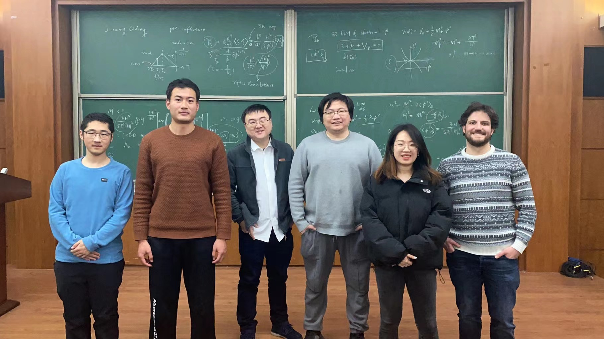
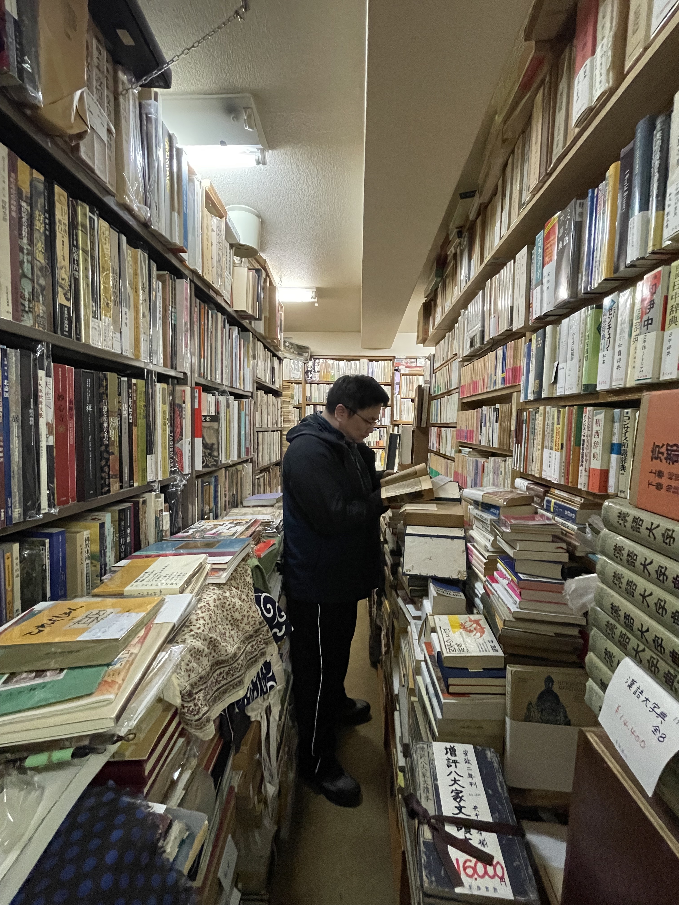
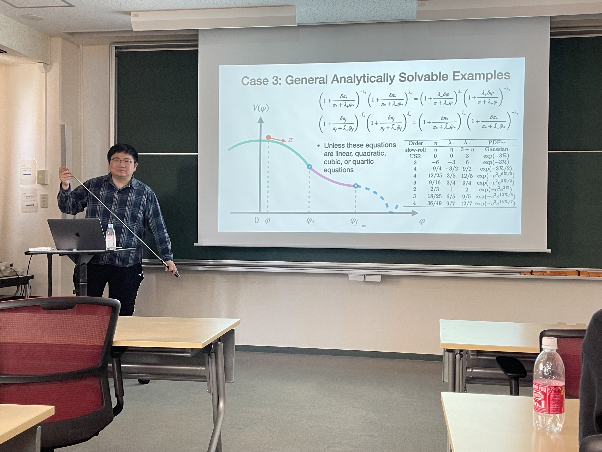
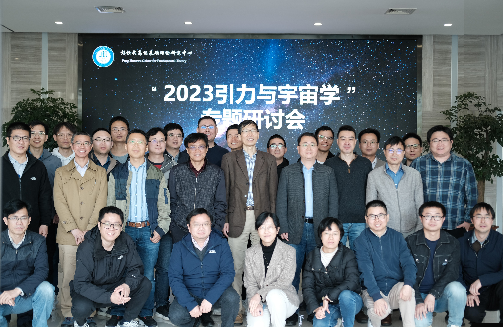
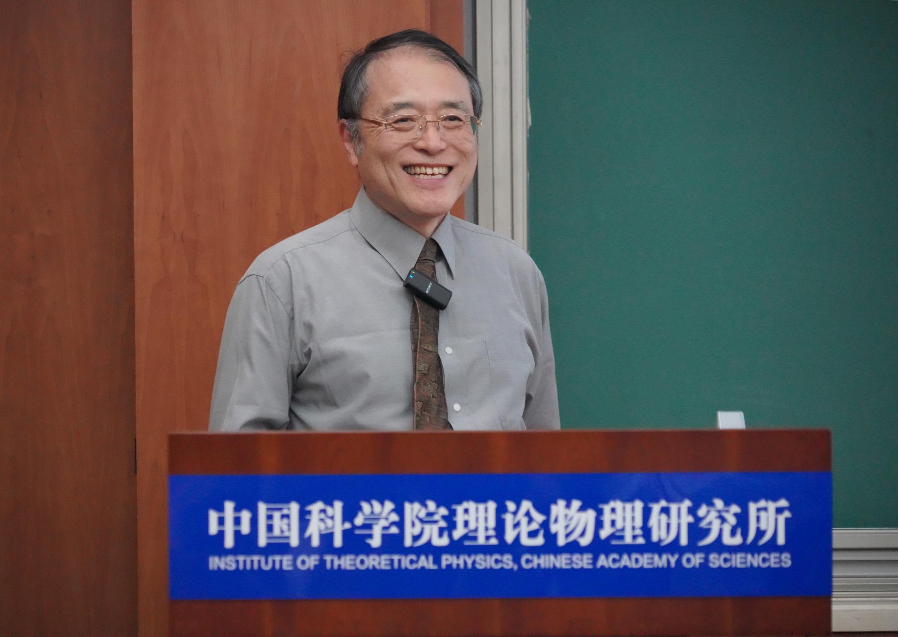
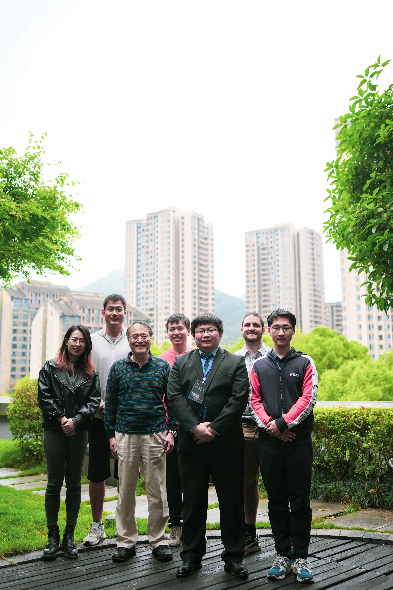
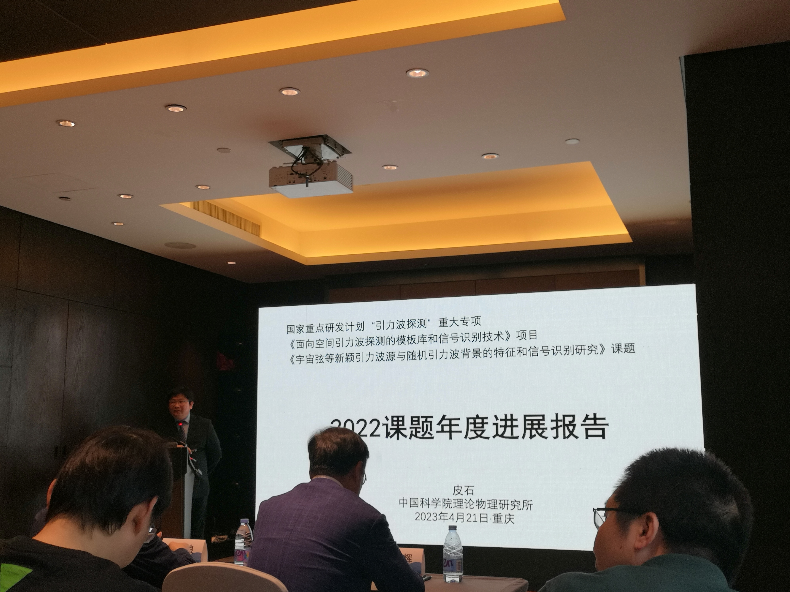

# 2023年

---

#### 1月

- **1月17日** 理论所春季进人面试。王少江等申请理论所副研职位。通过。 科学出版社二校稿成。请王依力、王嘉宁、王奥各读三章。

---

- ** 1月19日至2月6日返乡休假

---

#### 2月

- **2月10日** 调研小场暴胀相关文献。尤其是Linde, Nambu and  Sasaki, Bunch and Davies, Gong等。

- **2月16日** 与王嘉宁讨论小场暴胀相关文献。

- **2月17日** 蔡一夫来访。 召开本学期第一次组会。王嘉宁讲小场暴胀热初条件相关进展。一夫以为当求其圈图修正，以及研究$\eta$疑难。Cristian介绍其主要工作，即暴胀初条件、预热、振动子等。一夫坐而眠。 组会后一夫归旅次。与王嘉宁、洪文聪、李子涵等交流并晚餐。

- **2月21日** 理论所春季进人面试第二场。

- **2月22日** 初访北京大学高能中心。今年我入选北京大学高能中心李政道青年访问学者，是以常往。 Volodymyr言可固定诱导引力波丰度，以讨论原初黑洞丰度随计算方法之不确定度。盖其时彼已知NANOGrav等脉冲星测时阵列新结果之流言，故言。 与马滟青、康凯在北京大学燕南园餐厅晚餐。

- **2月23日** 10时听Cosimo Bambi报告，以X射线探测黑洞吸积盘之高能粒子辐射。 11时与王奥讨论，谈其论文之不妥处，命改正。 12时与佐公、Diego讨论。Diego略谈其进展，可重现概率分布函数之指数尾。 14时听余洪伟报告。论一对绕转原子间有量子纠缠及如何观测等。 16时与王嘉宁讨论，为王嘉宁及李子涵介绍原初黑洞形成峰理论之参考文献。

- **2月26日** 王嘉宁转发JCAP审稿意见，盖出自Starobinsky之手，亟辩其92年文章中已有功率谱之解析表达式。细读之，果然。唯其符号杂乱，故初读时未晓也。

---

#### 3月

- **3月1日**于王玮来，言已得Max Planck研究所Bruce Allen之聘。勉之。

- **3月2日** 10时听上海光机所刘亮报告，论微重力环境中之冷原子研究。 PRL编辑部返回审稿意见，一正一负，编辑不能决。 14时半蔡公大组组会，周勇讲哈勃常数问题。 会后曾祥熙来，命其就超慢滚平滑过渡至慢滚情况计算单圈修正。预计其圈图必压低，可破横山近日之怪论也。 16时组会。王奥、李子涵、王嘉宁各谈其进展。唯洪文聪进展缓慢。 与学生晚餐。 张云龙来。

- **3月3日** 往北大高能中心访问。见陈师斌，询问举办会议、在高能中心讲座、著书等事。 与王嘉宁讨论小场暴胀。

- **3月6日** 读Riotto文，已略论光滑退出超慢滚阶段可压低圈图修正。

- **3月7日** 与佐公、Diego讨论。 参加吴洁强午餐报告会。 13时与佐公、Volodymyr讨论。Volodymyr言可固定$f_\mathrm{NL}=1$，以讨论不同原初黑洞形成率、非高斯等效应，给出不同的$\Omega_\mathrm{GW}$以破Donkey等人文中之单一关系。请邀王嘉宁加入。公等许之。 为佐公讲Riotto新论文。 张云龙来谈。

- **3月8日** 王嘉宁、洪文聪来讨论。

- **3月9日** 蔡公组会。与学生午餐。与洪文聪讨论。

- **3月10日** 10时听陈师斌学术报告。陈师所言乃Carrollian场论，似亦有宇宙学应用。然此理论光速为零，其含义为何，殊不可解。 洪文聪来讨论。 往北大高能中心访问。改Cristian申请书。 

- **3月12日** 往天津。此时北京至日本尚未通航，不得已从天津出发。 顺访南开大学陈宁。陈宁介绍其近日所作之SU(8)大统一理论，言可解决等级问题并纳入引力子等。

#### 3月14日至3月31日在日本京都大学参加[小型研讨会“原始密度ゆらぎの非線形成長とその観測的帰結”](https://sites.google.com/view/nlcp2023/)

- **3月15日** 至京都大学基础物理学研究所。与章颖理、须山辉明等同办公室。 与Diego、Jason Kristiano等讨论。 作面上项目申请书。18时成而提交。

- **3月16日** 15时半参加Diego、章颖理、小幡一平等学术报告。 与成子笃、Diego Cruces、某氏贵广、章颖理、须山辉明、Jason Kristiano、平松尚志、小松一平等往京大农学部南门外顺菜餐厅晚餐。

- **3月17日** 与Diego讨论3小时。解决计算中问题若干。其间有一爬坡暴胀问题，可留至下一篇。

- **3月18日** 以章颖理之手机号注册ChatGPT，与之闲谈竟日，不倦。 午后往紫阳书店。女店主镰仓麻里在焉。店内唐本汉籍亦少，乃购平装本若干。

- **3月20日** 往汇文堂书庄。观览一过，无甚好书。问店主，其母尚在，九十余矣。唯遇车祸，正静养中。店主欲延之下楼。余亟止之。 与Diego讨论随机暴胀中$\delta\varphi$两点函数计算。

- **3月22日** 9时半至基研。见齐藤辽焉。 读Hassan Firouzjahi论单场暴胀圈图修正之文。其所得四点顶角之贡献为横山等所算结果之负20倍，殊不可解。 参加佐公组会。略介绍Riotto及Hassan之文。佐公指出若功率谱有一蓝谱指数，则所增倍数可压低。此又一解也。 组会后与多田裕一郎、藤田智弘、平松尚志、齐藤辽、章颖理、Diego Cruces等讨论。多田言Jason之计算未考虑哈密顿量之边界项。 与王嘉宁讨论，略言明日将与佐公、Volodymyr讨论之概要。

- **3月23日** 在山本书店、天牛书店网购古书若干。 10时听難波亮报告。 与佐公、Volodymyr、王嘉宁讨论。此初讨论以峰理论计算原初黑洞丰度也。 15时半听平松尚志报告，论修改引力之参数估计。 与Diego讨论，谈超慢滚暴胀结束条件等事。

- **3月24日** 13时半听齐藤辽、藤田智弘、Albert Escriva、章颖理、成子笃等学术报告。 其间孔镇郁至。与之寒暄。见其须髭鬓发已尽斑白矣。

- **3月26日** 与佐公讨论Jaume Garriga之评论邮件。

- **3月27日** 11时在京都大学讲报告《曲率扰动中的对数对偶》。  15时听Jason报告。多田裕一郎攻之甚急。报告完毕仍意犹未尽，二人板书以尽意。

- **3月28日** 在线听朱兴江学术报告，论脉冲星测时阵列。 15时听多田裕一郎报告，论常滚暴胀以解决单圈修正过大问题。 与多田、Jason、孔镇郁、横山修一郎等讨论。

- **3月29日** 往哲学之道赏樱。其间得张建东信曰蔡公任宁波大学校长。 返基研后与孔镇郁讨论。

- **3月30日** 18时许往田中貴浩办公室。略言单场暴胀圈图修正问题。参加田中研究室组会。介绍近期工作等。

---

#### 4月

- **4月3日** 王嘉宁来汇报进展。召Cristian、洪文聪同听。讨论3小时。 郭舒婷来，讨论人事变动及人才申请事。

- **4月4日** 理论物理研究所职工大会，蔡公作述职报告。 与佐公、王嘉宁讨论。王嘉宁略论其重推峰理论过程。 与佐公论修改论文事。请以$\frac{\delta\pi+\lambda_+\delta\varphi}{\pi+\lambda_+\varphi}$之守恒另作一文。公许之。

- **4月5日** 推导Vennin等人论文中半经典曲率扰动分布函数，得其领头阶近似为$\exp\left(-\#(\mathcal{N}-\langle\mathcal{N}\rangle_\mathrm{NLO})^2\right)$，大惑不解。

- **4月6日** 10时听柳浪报告。 往北大高能中心。往合肥。

#### 4月7日至9日在合肥参加[2023引力与宇宙学专题研讨会](http://pcft.ustc.edu.cn/w2023ylyyzxwztyth/list.htm)

- **4月9日** 作报告《原初扰动的对数对偶》。 与罗文涛谈。文涛告知将往深空实验室任职。贺之。

- **4月10日** 是日北京沙尘暴，狂风飞沙，遮天蔽日。

- **4月11日** 王一来访。邀参加组会。王嘉宁介绍小场暴胀课题。 与王一、李理、王少江、石弢、李伟等午餐。 14时听王一报告，论黑洞原子。王一录制一科普视频。 20时与洪文聪讨论。

- **4月12日** 往北大高能中心。李子涵来，与之讨论宇宙学微扰论。陈师携其门生张震宇至，言彼愿学宇宙学云。 与张甲举、吴洁强晚餐。

- **4月13日** 10时参加蔡公期刊讨论班。王嘉宁讲原初黑洞形成之峰理论。 与陈师、王一、张甲举、吴洁强午餐。 13时与佐公、Diego讨论。 16时与佐公、Volodymyr、王嘉宁讨论。 边立功来访。与边立功、郭怀珂、王少江晚餐。

- **4月14日** 11时往北大高能中心。与张震宇讨论。 12时半乘车往国科大怀柔小区会议中心。14时参加北京大学高能中心[高能物理前沿研讨会](https://indico.ihep.ac.cn/event/19310/)（李政道青年学者交流研讨会）。 20时王奥来。询问其学习情况。助其改幻灯片。

- **4月15日** 在交流会做学术报告。 报告后与李公重生谈。犹忆昔在北大上课时，常闻公言“宇宙学，小技耳，未足道也”，又曰“温公老矣！竟昏聩至斯而作《宇宙学》！”因问其详。公曰：“博后可转宇宙学。博士当作场论。不然，后劲乏力矣。”

- **4月19日** 佐公来访。与佐公讨论随机暴胀。 与佐公、王嘉宁讨论峰理论、小场暴胀。 与佐公、王奥讨论原初引力波紫外修正。 佐公、王嘉宁为理论所录制科普视频。

- **4月20日** 10时，佐公作彭桓武基础科学论坛特邀报告《原初黑洞可作为宇宙中的暗物质》。 往重庆参加引力年会。

- **4月21日至23日在重庆参加[中国物理学会引力与相对论天体物理分会“2023年学术年会”](http://cqutp.org/conferences/gr23/)

 

- **4月21日** 参加国家重点研发计划“引力波探测”专项《面向空间引力波探测的模板库和信号识别技术》项目年度交流会。并代表课题四《宇宙弦等新颖引力波源与随即引力波背景的特征和信号识别研究》作年度进展报告。

- **4月22日** 参加[中国物理学会引力与相对论天体物理分会“2023年学术年会”](http://cqutp.org/conferences/gr23/)并作分会报告。 

#### 4月24日至4月27日在合肥参加[深空实验室第一届“天都”会议](https://planet.ustc.edu.cn/icdss)

- **4月24日** 在天都会议上作学术报告。

#### 4月28日至4月30日访问浙江大学物理学院

- **4月29日** 与佐公、章颖理、马潇汉访岑人岳教授

---

#### 5月

- **5月10日** 周双勇来访。并作[报告](http://www.itp.cas.cn/kxyj/xshd/xsbg/202305/t20230505_6748930.html)。

- **5月18日** 往北大高能中心访问。邀请王一男来访。

#### 5月25日至5月29日在山西大同参加第七届量子信息、时空及拓扑物质国际会议

- **5月26日** 作学术报告。与张乐、茅奕晚餐并散步。会议中感染新冠肺炎，持续半月方愈。

---

#### 6月

- **6月3日** [Logarithmic Duality of the Curvature Perturbation](https://doi.org/10.1103/PhysRevLett.131.011002)为PRL接收。

- **6月12日** 边立功来访。优青会评事也。与之同推敲幻灯片。

- **6月14日** 章颖理来访。常进副院长调研理论所。 研究生同学焦春坤来。与郭志彬共晚餐。焦氏甫离职华为，将往德国某芯片公司。行前办签证到京，故有此聚。

- **6月28日** 章颖理来访。与洪文聪讨论。

- **6月29日** NANOGrav、EPTA、PPTA、CPTA等组联合发布新一期脉冲星测时阵列观测结果。其中NANOGrav、EPTA、CPTA三家均观测到纳赫兹引力波信号的Hellings-Downs关联曲线。

- **6月30日** 理论所召开建党纪念会议暨青年突击队授旗仪式。 引力宇宙学大组聚餐。

---

#### 7月

#### 7月1日至7月3日参加南开大学主办[第十六届粒子物理、核物理和宇宙学交叉学科前沿问题研讨会](https://indico.ihep.ac.cn/event/19074/)

- **7月7日至7月8日** 引力宇宙学大组多数师生往韩国开会。 理论物理研究所夏令营及保研学生面试。

#### 7月10日至7月14日参加兰州大学主办的[2023引力与宇宙学国际研讨会](https://lctp.lzu.edu.cn/content.jsp?urltype=news.NewsContentUrl&wbtreeid=1021&wbnewsid=2515)

- **7月16日** 组会。自10时至于17时。疲甚。

#### 7月17日至7月28日作为组织者参加日本京都大学基础物理学研究所主办的国际小型研讨会[Revisiting cosmological non-linearities in the era of precision surveys](https://sites.google.com/view/cnlws2023/home)

#### 7月28日至8月11日访问日本东京大学数物连携宇宙研究机构

---

#### 8月至9月

#### 8月14日至17日访问浙江工业大学[王安忠教授](https://www.baylor.edu/physics/index.php?id=68588)

#### 8月17日至20日在宁夏银川参加[2023年中国物理学会秋季学术会议](http://meeting.cps-net.org.cn/nxu2023)

- **8月19日周六** 午后4时40分在粒子物理、场论、宇宙学分会场作报告。

#### 8月29日至9月2日在山东威海参加[2023年中国天文学会学术年会](https://2023casmeeting.casconf.cn/)

- **9月2日**  
  于威海海滨游泳时遇海蜇，红色，宽一米。慌乱间游至深水区，由绳界处游回时乏力。时近晚暮，皆观落日，无人措意，周围数百米无一人，任余挣扎。须臾力尽，手足失衡，立而入水。恍惚间见天地皆蓝，落日尤甚。幸水浅，足触沙，跃而浮。平躺漂浮至岸边，然心悸不已。自幼及长，父母总不许往清江洑水，强往之，则怒不可遏。今观之，海河凶险至极，历此劫而不死者，亦天幸也。

#### 9月24日至9月27日在湖北宜昌参加[第二届天文中的机器学习系列会议](https://machinelearning2023.casconf.cn/page/1663147986017980416).

#### 9月28日至10月--日会后返乡度假。

---

#### 10月

- **10月5日** 初，疫情间居家无事，日记特详，日皆有考。放开后会议增多，奔波劳碌，无力作文，事迹失载。岁月邈远，恐失其真。常思作网志博客，从其简便易用也。今乃借度假数日，用github作个人主页。先从知乎借一通人仓库叉之，又略改数日，以尽其用，即此站也。 与肖露谈。彼公司破产，燕居家中，闲暇无事，从之沿夷水南岸二桥间散步。

- **10月7日** 乘机返北京工作。

- **10月10日周二** 与王嘉宁、王奥讨论。科学出版社送《宇宙学的物理基础》赠书100册。佐公来访。听Kai Schimitz的哥白尼报告，介绍NANOGrav新物理文章。

- **10月11日周三** 12时参加佐公期刊讨论班。Kaloian介绍新论文。与佐公、王嘉宁、洪文聪、王奥、章颖理、王欣芃讨论。王嘉宁及王奥各介绍其最新结果。

- **10月12日周四** 洪文聪往机场迎接郡和范。午后2时半蔡公组会。Cristian介绍工作。几眠。晚，与佐公、郡和范、Cristian、王嘉宁、王奥、王欣芃等讨论。与佐公、郡和范、孔镇郁、章颖理至世纪科贸大厦地下大排档晚餐。餐后至佐公旅次饮酒。至1时半。孔镇郁言其新收二大四女生，乃令其算张量扰动四阶作用量。佐公哂之。

#### 10月13日至15日组织举办国际小型研讨会[*Gravitational Waves in the Early Universe*](https://indico.itp.ac.cn/event/171/)

- **10月13日周五** 理论物理专款50周年纪念活动召开，未能参加。与王嘉宁、李子涵至西郊宾馆主楼前台摆注册台。诸公皆至。

- **10月14日周六** 国际小型研讨会“早期宇宙中的引力波”召开。余主持开幕式。吴公岳良致辞。佐公、吴公分别作开幕报告。具体信息请查看此处的[会议手册](../pdf/GWEU23_handbook.pdf)。会议新闻稿[点此](http://itp.cas.cn/xw/zhxw/202311/t20231103_6915362.html)。

- **10月31日周三** 陈一帆做学术报告《[Strong Gravity Frontier of Particle Physics](http://www.itp.cas.cn/kxyj/xshd/xsbg/202310/t20231024_6905466.html)》。

---

#### 11月

- **11月1日周三** 日本工业大学教授[须山辉明(Teruaki Suyama)](http://www.th.phys.titech.ac.jp/cosmo/suyamaweb/home.html)来访。言彼在booking.com所定宾馆不能接待外宾，亦奇闻也。代为定物科。 王赛来访。陈一帆做学术报告《Strong Gravity Frontier of Particle Physics》。 与须山辉明、Cristian Joana、周勇、陈一帆、王嘉宁、王少江、王赛、胡建萍等同往清华科技园晚餐。食毕雾霾大起，pm2.5>300。与须山辉明、张云龙、陈一帆、Cristian置酒高会。

- **11月2日周四** 上午清华大学邱中心杨镇斌报告。堵车，未能赶到，在线听之。 午后调整2023年理论物理研究所引力与宇宙学研讨会参会人员名单，以符蔡公所言“二百人以下”之宗旨。 与须山公食驴肉火锅。食毕往我家同饮至23时方散。

- **11月3日周五** 10时参加须山公报告《[Kramers-Kronig relation in gravitational lensing](http://www.itp.cas.cn/kxyj/xshd/xsbg/202310/t20231030_6910835.html)》。 午后组会，参加者有须山公、Cristian、王嘉宁、洪文聪、王奥、李子涵。Cristian介绍其最新论文等。与李子涵讨论。 6时许与须山公、Cristian往食烤肉。旋往机场乘机往重庆。至酒店时已2时矣。

#### 11月4日至11月5日在重庆大学参加彭桓武科教中心理论物理前沿论坛

- **11月4日周六** 参加开幕式、合影、上午学术报告等。午后乘电瓶车回酒店午休。 晚宴略饮酒一罇。周思益言将直播宣传穆公书，且印制书签若干，于宴会厅分发之。

- **11月5日周日** 中国科学院理论物理研究所李理副研究员荣获亚太理论物理联合会(AAPPS)及亚太理论物理中心(APCTP)联合颁发的[杨振宁奖](http://www.itp.cas.cn/xw/zhxw/202311/t20231107_6916456.html)。 自酒店步行至重庆大学理科楼群报告厅参会，作报告。午餐后散会。 与文毫、王志伟、宋宁强往鹅岭公园瞰胜楼游览。

- **11月6日周一** 午后飞往上海虹桥。

- **11月7日周二** 往上海大学访问。作学术报告《曲率扰动的非线性》。 与葛先辉、张弘、吴绍峰、蔡文赫、王依力等晚餐。

- **11月8日周三** 往合生汇游览、抓娃娃、得可爱鬼三。午餐后往上海交大闵行校区。 何公红建来信言临时出差往北京而不能参加学术报告。

- **11月9日周四** 上午10时在上海交大核天体物理研究所作学术报告《标量诱导的随机引力波背景》。所在皆粒子物理诸公，故科普介绍为主，个人成果则简介而已。 与孙艺峰、高俊、刘航午餐并饮咖啡。 见何公小刚，闲叙并赠译著。 葛绍峰、陈一帆来。同晚餐并讨论李所人事等事。

- **11月10日周五** 10时半往同济大学，与须山辉明、Cristian Joana讨论非球对称坍缩产生引力波背景课题。 时无黑板，往金磊室借之，因与闲谈，并饮咖啡焉。 言谈间任公中洲来。启其扉而问起居，似忘我矣。赠以译著。 下午3时Florian Künel来。闲谈移时，往物理系。Florian作报告《Primordial Black Hole as Dark Matter》。初，余览李所主页，见Florian来访李所，作报告，然时间与余在闵行报告同，不能听，故邀其访理论所。彼言下周将去日本IPMU参加原初黑洞焦点周，无暇来访。乃改邀之往同济大学，许之，故有此会。余与Florian神交已久，然仅邮件往还，未曾会面。此次因余览李所网页而邀之，往来数日促成此事，亦速也。 与Florian、须山、葛绍峰、章颖理、Cristian、王依力晚餐。餐后与Florian、须山、章颖理、Cristian至大学路酒吧饮酒。

- **11月11日周六** 10时与佐公、Volodymyr Takhistov、王嘉宁在线讨论。佐公提出一“过滤函数”以取代窗函数，借之以计算原初黑洞丰度，则无紫外对数发散问题。 至徐汇区西岸艺术中心观拉乌尔·杜菲(Raoul Dufy)画展。 与章颖理闲谈。

- **11月12日周日** 返北京。

#### 11月20日至21日在东北大学理学院访问

- **11月21日周二** 作学术报告。惜乎沈阳故宫维修不开放。观览大帅府等景点。

- **11月23日周四** 至北京大学KIAA听莫厚俊学术报告，才疏学浅，未能尽晓。与邵立晶谈。 往蓝旗营小区送译著与李公重生。李公精神矍铄，神采奕奕，谈早年赴美往事、指导学生事。又言及早年网络流传之[《中华第一系物理讲义页边集》中耳食之谈](https://www.douban.com/group/topic/6087175/?_i=3570181fPSInhH)，情绪激动，必字斟句酌，以正其源。

#### 11月24日至25日在三亚清华论坛参加引力波探测专项年度交流会

- **11月24日周五** 入住三亚清华论坛客房。游泳1小时。

- **11月25日周六** 为引力波模板课题四作课题总结报告。参加晚宴后乘机往上海转机。

#### 11月26日至12月2日在日本名古屋参加第32届日本广义相对论与引力会议(JGRG32)

- **11月26日周日** 到达日本名古屋市。

- **11月27日周一** 下午参加第32届日本广义相对论与引力会议(JGRG32)。作大会报告《Non-Gaussianities in the PBH Formation and Induced GWs》。幻灯片[点此](../pdf/JGRG32.pdf)。 

- **11月29日周三** 携王嘉宁与佐公、柳哲文讨论。 
  会议合影 

---

#### 12月

- **12月1日周五** 会议结束。须山辉明、太田敦久请余及章颖理晚餐。食日本国产鳗鱼，价极昂。

- **12月2日周六** 参加田中貴浩公组织之《用引力波探测暗物质粒子》重点项目年度研讨会。

- **12月3日周日** 往京都。入住宾馆。往下鸭神社观红叶。

- **12月5日周二** 与田中貴浩公讨论$\delta N$形式中纳入梯度项等问题。田中公言须作格点模拟。且命其博士后Danilo作之。 与田中公食大阪串、饮酒。

- **12月6日周三** 与田中貴浩公讨论$\delta N$形式中纳入梯度项等问题。  

- **12月7日周四** 返北京。

#### 12月8日至11日在京郊春晖园酒店组织2023引力与宇宙学研讨会

- **12月8日周五** 与王嘉宁、张震宇、洪文聪、王奥、李子涵在酒店前台负责接待工作。

- **12月9日周六** 会议开幕。会议手册[见此](../pdf/2023chunhuiyuan.pdf)。会议新闻稿[见此](http://itp.cas.cn/xw/zhxw/202312/t20231229_6932270.html)。

#### 12月16日至19日在南京参加[第17届TeV工作组学术研讨会](https://indico.ihep.ac.cn/event/20782/)并访问紫金山天文台

- **12月17日周日** 参加[第17届TeV工作组学术研讨会](https://indico.ihep.ac.cn/event/20782/)并做大会报告。

- **12月18日周一** 访问中国科学院紫金山天文台。听郁海波老师报告《Exploring the Signatures of Strong Dark Matter Self-Interactions》。 南京暴雪。往栖霞寺观雪景。

- **12月19日周二** 访问南京师范大学武雷老师。作学术报告。

- **12月20日周三** 参加佐公期刊讨论班。

- **12月22日周五** 组会。洪文聪、李子涵、王奥等汇报进展。

---
