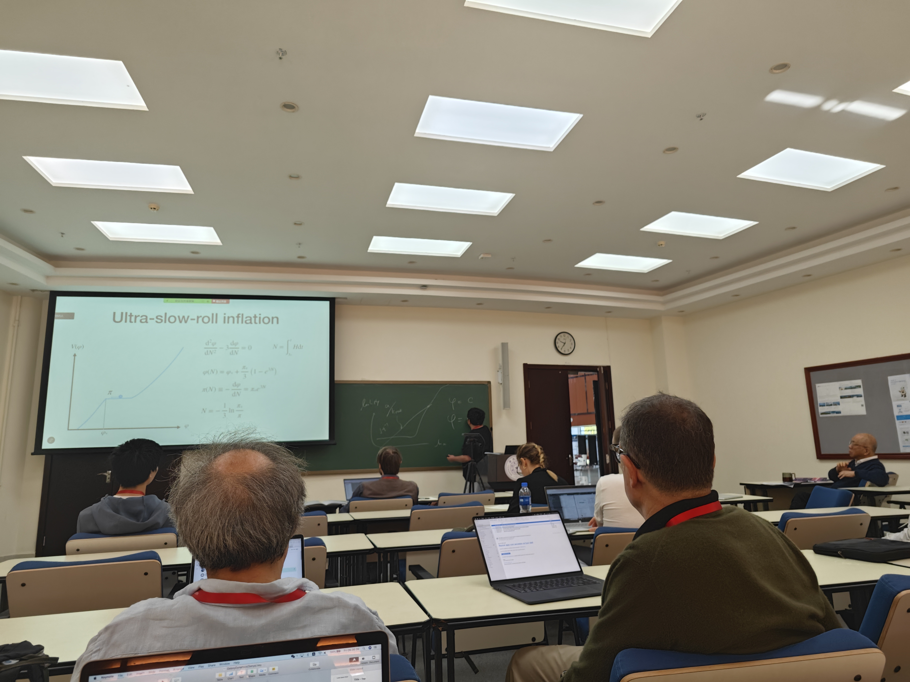

# 学术日常

---

#### 更多历史记录请移步[ARCHIVE](https://stonepi.github.io/archive/)

#### 2025年1月1日至1月11日日在北京工作

- **1月1日周三** 校对《原初黑洞》书《非高斯》章，得乙误处若干条。3时半发校对稿与编辑部。 <!--眠终日。翫黑神话·悟空。二周目通关且达成全成就。-->

- **1月2日周四** 为prd审稿。整理2024年学术随笔。 晚餐后在北京大学高能中心办公室小憩假寐，怪梦连连。

- **1月3日周五** 在北京大学高能中心开组会。Diego、张震宇、洪文聪、王奥、李子涵、蔡坤雨参加。先与Diego讨论$\delta n$方法论文，相图及概率守恒等事。余介绍与王嘉宁等新论文[2501.00295](https://arxiv.org/pdf/2501.00295)。诸生问难若干。洪文聪汇报如何在LISA、太极、天琴探测器噪声中扣除来自银河系内白矮星前景噪声之模拟信号，并由此限制空间引力波探测器之性能。李子涵介绍韩成成等新作[2412.16033](https://arxiv.org/pdf/2412.16033)、[2412.21045](https://arxiv.org/pdf/2412.21045)。简单讨论后，知其大略。                                                                                                                                                                                                                                                                                                                                                                                                                                                                                                                                                                                                                                                                                                                                                                                                                                                                                                                                                                                                                                                                                                                                                                                                                                                                                                                                                                                                                                                                                                                                                                                                                                     

- **1月4日周六** <!--翫黑神话·悟空三周目，过第一关。-->

- **1月5日周日** 修改天琴白皮书。将Postnov所写部分改编，作为引言。又改王赛增加之非高斯一节，增讨论峰展宽一段。5时完成。

- **1月6日周一** 10时与Alexey Koshelev、Andrea Addazi、Anna Tokareva讨论修改论文事。午后往北京大学高能中心。修改太极白皮书，15时许上传图片等，并告成于梅健伟公。时神乏意困，乃眠。 Danilo来信催读其所改论文及编辑部回复。许之以本周内。

- **1月7日周二** 11时往北京大学高能中心。 13时半往理论所北楼。14时主持韩成成学术报告《[中微子跷跷板机制的宇宙学信号](http://itp.cas.cn/kxyj/xshd/xsbg/202501/t20250102_7512844.html "Cosmological Signatures of Neutrino Seesaw")》。会后讨论。余于韩成成选取Higgs粒子之背景值为其概率分布之方均根，终不能孚。 与韩成成、张云龙、王少江往理论所东北门对面之川菜馆“最成都”聚餐。忘与角马、奥勃21时讨论。角马来信让余。余称谢。究其由，乃小米手机未能自动同步icloud日历事件之故。研究一小时后方同步之。

- **1月8日周三** 11时许往中国书店灯市口书店看书。未见佳者。 15时往北京大学高能中心。

- **1月9日周四** 11时往北京大学理科教学楼西北侧“诚”字石处见吴小征。与之俱往未名湖散步半周，又往西门，南往家园餐厅四楼食小火锅。于路闲谈彼此现状及大学同学现状。彼亦关陇旧勋，虽亦曰蹉跎，然气象、眼界自阔。观其所由，察其所安，重整旗鼓，不为难也。 14时半往北京大学高能中心工作。宇研构(IPMU)田村阿姨来信，言余主页之宇研构特别研究员不确，当为特任研究员。又言余在基研所(YITP)时职位特任助教亦不确，当为”周30时间勤务研究员“。繁文缛节，不成名堂矣。世皆言日人工匠精神，若耗于斯，其能久乎。 18时高昕来。与之闲谈。彼参加李田军公离理论所往河南师范大学之送别会，故不远千里由四川大学来此。又在北京大学高能中心作报告。约以下学期访之。 查近期讨论引力波红外标度律论文。去邮索引用若干。

- **1月10日周五** 8时乘车往高能物理研究所参加《中国物理C》期刊编委会议。入高能所主楼会议室，见大学同窗梁豪兆君。彼已做编委六年。余因问周所长提出将邀之回国事，彼笑言难，子女在日本上学故也。 9时会议开始。王贻方公致欢迎词，之后董海荣、IOP编辑、吕才典公分别作进展报告。引力方向稿最多，而拒稿率亦最高。陈师斌作编辑，不送审者几半。吕公嘉之。 茶歇时诸公闲谈。王贻方公云引力、高能天体物理、宇宙学方向稿多，当另聘一副主编为之。又诸公言人事变动，如陈师斌往宁波、李田军公往河南师大、高亮公往郑州大学等。 会议继续。各编委陆续自我介绍，并提建议。余新来，不知其窍，乃言愿学。散会后往专家餐厅午餐。 餐后与张鑫公往多学科楼咖啡厅。王赛至。邀张公与余饮咖啡，闲谈。王赛云前年无基金，百人已结题，青黄不接，课题组无力维持云。余问张公去年其携徐怡冬、王赛之重点项目何以折戟。公曰会评时专家嫌其已有SKA之国家重点研发云云。 14时张鑫乘车往朝阳站。王赛亦去。余往3楼寻张公新民。公正与郭兆麟等视频会议。乃于门外监控室候之。至14时半，公会毕。乃与之往楼下咖啡厅饮咖啡。余德张公之举荐，赠之译著。公因忆昔年与Alex Vikman、Robert Brandenberger等从游之往事。又列举中国早期宇宙之衮衮诸公。<!-->公命余会所后与周所长谈理论所加入阿里计划事。余唯唯。<-->  15时半返北京大学高能中心开组会。张震宇、洪文聪、王奥、李子涵、蔡坤雨、廖涌贤参加。廖涌贤介绍其超导宇宙弦工作。蔡坤雨介绍读余前作[1909.13728](https://arxiv.org/abs/1909.13728)之进展及困难。洪文聪介绍扣除河内双白矮星绕转前景相关问题。王奥介绍curvaton相关项目之进展。与廖涌贤谈。勉之。李子涵汇报学习韩成成新文及Starobinsky与横山顺一之[astro-ph/9407016](https://arxiv.org/abs/astro-ph/9407016)最新进展。李子涵独立推导出$\lambda\phi^4$理论中演化到后期场达到平衡状态之概率分布函数为   
 
  $$
  P(\phi)\sim\exp\left(-\frac{4\pi^2\lambda\phi^4}{3H^4}\right),
  $$

亦难能也。 18时半洪文聪、王奥往理论所参加新年晚会。余与李子涵、蔡坤雨步至北京大学南门外老蜀人晚餐。 是日与佐公、Volodymyr Takhistov、Kaloian Lozanov、王奥合作之论文[*Axion-like universal gravitational wave interpretation of pulsar timing array data*](https://doi.org/10.1088/1475-7516/2024/08/054)发表于CQG。

#### 1月12日至1月17日在清华三亚数学论坛参加会议

- **1月12日周日** 眠至9时。12时40分乘飞机往三亚。于路昼寝。16时40分落地。18时到清华三亚数学论坛入住。晚餐后练习台球。20时返室。时见泳池开放，下水游泳。然其时三亚夜间温低，泳池露天水寒，下水后觳觫不止。勉力游数百米而还。

- **1月13日周一** 9时往会场。听郭琦、Wiltshare氏学术报告，皆结构形成。午餐时见卢公建新、黄民信、宋伟等。彼在此举办弦论冬季学校也。午餐后与胡彬台球，4:1大胜之。其间见丘公成桐与宋伟等自食堂出，于门厅闲谈。 返室后困倦，小憩，未去会场，居室工作。18时往晚餐，遇杨镇斌。餐后练习台球一小时。出汗后返室。

- **1月14日周二** 未去会场，居旅次审prd稿。 16时许与佐公、Diego讨论。Diego详释超慢滚暴胀$h$参数之义。公乃嘱之著文，且命其一周蒇事。盖Diego已在泰国讲过，惧其为人掠美故也。 初，听韩成成报告之后，余重审Higgs不稳定性问题。前人皆以Higgs势为可略，乃以高斯概率分布写之。然其方差中$e$叠数之选取，甚为无谓。余弗取焉。言之与佐公、Diego，皆以为然。略讨论之。 <!--Volodymyr来信提议王嘉宁继续研究峰理论算法之简化拟合表达式。王嘉宁言之曰：“将忙于毕业、求职，不能为此。虽能，拟合事非吾所愿，不欲为之。”佐公来信劝之，曰：“余知君事繁。然事定后可三思欤？”王嘉宁曰：“公知之，幸甚。”余不敢赞一词。-->

- **1月15日周三** 11时与赵文出游。午餐食烤乳猪。餐后往三亚湾散步观海。三亚湾面朝南海，沙滩狭长，沙白而细，乃濯吾足，履沙而东行二里余。饮椰浆。乘车往大小洞天。参观宋代摩崖石刻、郭沫若题词、江泽民题字等胜迹。时逢涨潮，巨石上蹲倨小蟹数十百只，或横行石上，或随浪跌落，亦奇景也。 与赵文观海，闲谈基金申请及人事变动等事。<!--赵文云邵公成刚、蔡公庆宇皆由引力方向而上杰青者，非余所谓二十年来无一人者。又云见王赛申请杭州师范大学抑或杭州电子科技大学教职之外审材料，盖将欲跳槽云。-->18时许落雨，遂归。 21时与角马、奥勃讨论。角马终不信奥勃所得$\delta\varphi$之功率谱，又与余辩泡型原初黑洞成立条件。盖平台势超慢滚皆有反跳而滞之虞，无关乎下阶段演化，即与非高斯亦无关也。

- **1月16日周四** 偶然见此主页自2024年8月设置计数器以来访问量已超万。奇之。 午后往会场。然其报告多正规数学式相对论或宇宙学，难以尽晓。 晚餐后与王少江台球。3:0胜之。 调研一般截断之超慢滚暴胀中曲率扰动概率分布函数计算方法。查询高斯变量任意函数之概率分布函数。复杂函数解析不可为，唯数值积分及快速傅里叶变换等法可近似。

- **1月17日周五** 8时半往会场。作报告。参会者多非颛门，故于关窍处详推审之。自觉圆融无碍，然听众呆若木鸡，盖未尽晓。讲完回首时见一老翁蹒跚而出，丘公成桐也。余演讲时向来自说自话，鲜觑听众，故未能措意也。  13时与本桥隼人、多田裕一郎、王嘉宁讨论。与本桥、多田比较其论文[1812.08243](https://arxiv.org/abs/1812.08243)及[2303.16035](https://arxiv.org/abs/2303.16035)中非高斯之异同。虽皆写$f_\mathrm{NL}(k_L,k_S,k_S)$，然二文所用自变量不同。且皆非尖锐阶截断。则其非高斯不同，亦有自矣。然必细审其定义，方知计算原初黑洞丰度及诱导引力波能谱时，所用$f_\mathrm{NL}$者何。又细读Byrnes等论文[1811.11158](https://arxiv.org/abs/1811.11158)，知其早已得常滚暴胀中功率谱之解析表达式矣。 往三亚清华数学论坛图书馆。见藏旧书数十架。英文书皆数学相关，中文书则文史哲皆有，大率为清华大学图书馆转赠之旧藏，间或亦有滥竽充数者。读丘成桐自传2小时，至其在陈省身处得博士学位而后止。 与陈师斌、卢公建新晚餐。餐后随之散步。告陈师Cristian将申请宁波大学教职事。师曰：“若其发表中式，可命其径申之。”

#### 1月18日至21日在三亚红树林会议中心参加北京大学高能中心年度研讨会

- **1月18日周六** 午后2时退房后往天涯海角游览。步行由入口北行至海判南天、南天一柱、天涯海角等石刻处游览。观日落。履沙步归。 20时乘车往红树林度假酒店入住。食香焖东山羊。

- **1月19日周日** 审阅Danilo回复审稿人意见稿及改《推广$\delta N$方法》修改稿。 晚餐食红磨坊餐厅自助。与曹庆宏、赵明刚、李新强、刘朝峰、王健、刘言东等闲谈谈。

- **1月20日周一** 前年9月往慕尼黑时，马公(Slava Mukhnov)谈及其朝鲜高足、康氏(Jin U Kang)拒其荐欧职，毅然归国，任教于金日成大学之事。余查其履历，2020年后便销声匿迹，以为改作国防军工。今则见康氏携数生徒发文论Horndeski引力之反弹宇宙学。可见其在朝鲜仍作科研也。唯传言朝鲜不通外网，不知彼何以连arXiv发文。 16时半往三亚湾海滩散步1小时。 18时与田中公、Danilo讨论《推广$\delta N$方法》论文修改稿。审稿人乙意见尖锐，嫌文长，又条陈难解处十余条。一一讨论之。 晚餐食椰子鸡。

- **1月21日周二** 12时往御粤阁午餐。席间李重生公谈丘成桐与田刚、北大交恶往事等。 14时半参加北京大学高能中心年度研讨会。在场诸公有陈师、冯旭、马伯强、刘玉鑫、曹庆宏、朱世琳、马滟青等。作年度进展报告。任婧、陈师斌略有问难。 18时往御粤阁晚餐。餐后与赵公、马滟青等散步一圈。赵公问理论所近况。余答以经费使用及预聘考核等事。又谈及杨金民、李田军二公离所往河南师大等事。马滟青问2025年李政道青年学者遴选结果。<!--赵公对之曰张扬、岩斌。--> 与马滟青谈。马氏知余考核已过，贺之，又曰：“兄当善保贵体，少食多动。每见兄胖于往昔，心甚忧之。弟虽事繁，隔日必游泳，周末携子狩猎，略健体焉。”余唯唯。 是日与边立功、王少江所作综述《[起源于早期宇宙的随机引力波背景: 综述及展望](http://engine.scichina.com/doi/10.1360/SSPMA-2024-0539)》在线发表。

#### 1月22日至24日在武汉大学天文系访问

- **1月22日周三** 8时许乘机往武汉。 18时与田中公、Danilo讨论修改《推广$\delta N$方法》。

- **1月23日周四** 11时往武汉大学物理学院。与范锡龙、杨涛闲谈、午餐。餐后同游狮子山武汉大学历史建筑、主楼、珞珈山别墅群、东湖栈道、游泳池，遥望东湖宾馆。返校后与范锡龙讨论、闲谈。锡龙言教育部申请系统中多一“引力波天文”方向。余忆昔传言基金委将新开一引力波方向，命郭公宗宽总其事，余亦写一段，盖即此也。 20时与蔡坤雨讨论。释彼推导引力波能谱、张量扰动解析解等之疑。 21时与角马、奥伯讨论。奥伯所画功率谱大致可用。然其画$\delta\varphi$、$\dot{\delta\varphi}$之互关联

  $$
  \gamma=\frac{\mathcal{C}_{\delta\varphi\dot{\delta\varphi}}}{\sqrt{\mathcal{P}_{\delta\varphi}\mathcal{P}_\dot{\delta\varphi}}}
  $$

有一符号翻转，未知何故。
