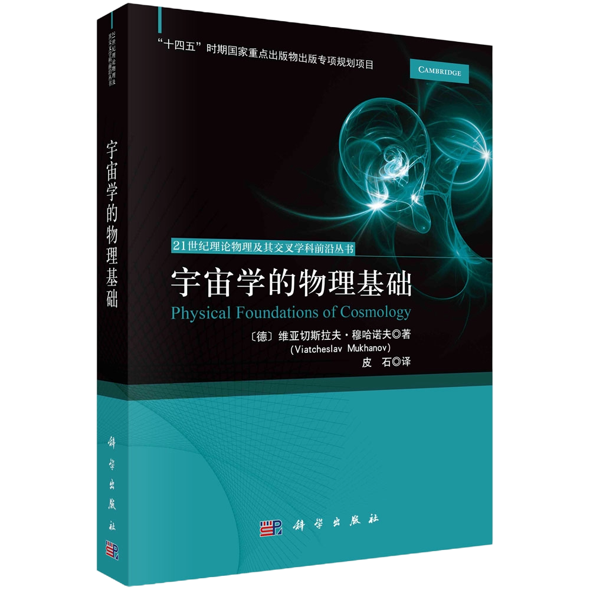

# 学术日常

---

#### 更多历史记录请移步[ARCHIVE](https://stonepi.github.io/archive/)

#### 12月9日至12月31日在北京工作

- **12月28日周六** 17时与角马、奥伯讨论。奥伯所画$\zeta$、$\dot\zeta$、$\delta\varphi$、$\dot{\delta\varphi}$等功率谱，仍有问题，疑问重重。

- **12月27日周五** 14时在北京大学高能中心开组会。Diego、洪文聪、王奥、李子涵、蔡坤雨参加。先讨论Press-Schechter形式中引入窗函数之困难。讨论移时，未得其解。星系宇宙学常用窗尺度$R_W$定义暗物质晕质量$M_\mathrm{halo}\propto R_W^{2}$，然如何作成一连续函数，似未尽晓。蔡坤雨介绍本科毕业论文中期答辩。洪文聪介绍论文总体结构等。Diego讨论常滚暴胀相图中若干问题。 19时与学生在高能中心大厅晚餐、闲谈。

- **12月26日周四** 11时至理论所北楼与郭宗宽公讨论《物理》杂志科普文章事。12时许往基础园区食堂午餐。遇吴小宁、田雨、张宏宝。餐后同往数学所咖啡厅饮咖啡，闲谈。吴小宁言丘成桐精力旺盛，事必躬亲。虽招聘博士后等纤芥之事，亦亲为之。又言毛公秘书三班倒连轴辅之，方不误事。建国后群僚或休或病，如罗荣桓、刘伯承、刘亚楼、陈赓诸公，皆多灾病，或蚤死、或离休。公闲庭信步，举重若轻，革命不已。余忆昔李小源公云李政道公每回国必查高等科学技术中心账目，与夫人夜半对账翻查发票等事。又忆前日佐公来，参会一日，精神抖擞，又饮酒至丑初。学生不惯夜饮，疲惫不堪，呵欠假寐，呆若木鸡。公雄姿英发，目光炯炯，觥筹交错，清谈不倦。次日早起参会，独坐前排，高言问难，未见疲色，而诸生宿醉昼寝，安然高卧，无人肯来。伟人天命将圣、精气充盈、才力兼人、神思活跃，非我等苍头布衣、四十而衰、平居则倦、眠不知觉者可比也。 14时往北京大学高能中心，遇镰田耕平将行。与之作别。

- **12月25日周三** 午餐后往中国书店海淀桥店。购
  
  - 《世说新语笺疏》，精装本一册，中华书局1983年一版一印
  
  - 列子集释，平装本一册，中华书局1979年一版一印
  
  - 中国新石器时代陶器装饰艺术，平装本一册，文物出版社1982年一版一印
  
  晚餐后往豆瓣书店。购
  
  - 宋元戏文辑佚，平装本一册，上海古典文学出版社1956年一版一印

- **12月24日周二** 14时往北京大学高能中心听镰田耕平报告。细节过多，不够通畅，未能尽晓。 读佐公与王欣芃、马潇汉新论文[2412.16463](https://arxiv.org/abs/2412.16463)，谓细推余旧文[2211.13932](https://arxiv.org/abs/2211.13932)以完全分析分段平方势暴胀模型。

- **12月23日周一** 11时与本桥隼人、王嘉宁讨论常滚暴胀功率谱的解析计算问题。谈及非高斯，仍无从措手。王嘉宁言将往韩国基础科学研究院面试。为之改幻灯片。

- **12月20日周五** 14时在北京大学高能中心开组会。Cristian、Diego、洪文聪、王奥、李子涵等参加。李子涵先介绍最大e叠数课题进展。其中最大e叠数与张标比r无关一节，终不能明。命其重写。洪文聪介绍随机引力波背景信号探测方法等。Diego介绍$\delta n$方法著文进展。 19时陈一帆来闲谈。言彼将往上海交大、复旦、清华等校求职等事。 21时与角马、奥伯讨论。先问角马常滚暴胀中概率归一化问题，后讨论合作课题进展。奥伯言体乏欲眠，许之。改以他日。

- **12月19日周四** 14时半往国家天文台听Bruce Allen学术报告。Bruce介绍其新作[2407.10968](https://arxiv.org/abs/2407.10968)及相关进展。会后王奥与之讨论并谈及往汉诺威访问事。Bruce大喜，云：“至，则命癸林引至我室。”且欢迎其参加组会焉。 与金洪波谈太极进展。有忧思。且前年未得数据处理之国家重点研发计划，大伤元气云云。又谈及蔡公钦点余为天琴写白皮书事。金洪波云：“蔡公谋虑深远，算无遗策。虽看似漫应，实考虑周全。” <!--又云：“今公往宁波大学作校长，势必酬唱教育部诸公，故必入天琴也。而不令亲炙生徒如云龙者入，盖不欲令吴公知其贰之也。”--> 与张云龙食烤肉。食毕返家与角马、奥伯讨论。奥伯未准备，改以翌日。

- **12月18日周三** 12时往理论所北楼与冯维祥午餐。 14时半主持冯维祥报告。组员等皆听之。又洪文聪与之讨论移时。 16时半往北京大学高能中心工作。写天琴白皮书。从张建东之议，将已写成者录入overleaf。

- **12月17日周二** 9时半往北京大学理科教学楼东侧停车场乘车往八宝山殡仪馆参加吴月芳师告别仪式。 11时半返北大。与陈弦、邵立晶往燕南地下食堂午餐。餐后往高能中心。

- **12月16日周一** 9时在理论所北楼参加2024年年度考核交流会。今年论文数虽多，然乏善可陈，推广$\delta N$方法虽差可，然未发表。故意兴阑珊，草草了事。

#### 12月14日至12月15日在京郊春晖园酒店参加理论物理研究所彭桓武创新研究中心引力和宇宙学研讨会

- **12月15日周日** 8时半往会场参会。10时半主持第二节。王奥送佐公往机场。 午餐后与杨桓、边立功、周也铃闲谈。 晚餐后乘车往北京大学高能中心。写年度交流会幻灯片。

- **12月14日周六** 8时半往会场参会。听陈师斌、宋伟报告。茶歇时与陈师闲谈。 <!--陈师言黄庆国参加中国科学院基础前沿科学研究计划从0到1原始创新项目结题评审。口若悬河，天花乱坠，醍醐灌顶，大狮子吼。评审诸公入其彀中，与之最优。师又问与王依力感情进展、王依力求职等事。--> 午后听李虹介绍AliCPT最新进展等。茶歇时与张公新民、佐公谈。 茶歇后乃讨论理论物理前沿科学问题建议，李理主持，群贤依次发言。 晚餐食烧烤。略食片刻，命王奥等陪侍佐公。乃归与角马、奥伯讨论。 10时许与Cristian、诸生往佐公旅室饮酒闲谈。

#### 12月9日至12月13日在京工作

- **12月13日周五** 11时与佐公往北京大学高能中心。13时王嘉宁来讨论峰理论论文。 王嘉宁言将不来组会。 <!--问之故，曰：“事多，周费一日，不可。”余曰：“可不来。然须定期发函汇报。”曰：“今与山口公合作，即有定期讨论矣。何以函为？”余愠，曰：“然其如往韩国时渺无音讯耶？”曰：“非无音讯。彼报告多，组会勤，讨论深，日忙碌，无闲暇也。”余知其不可为也，听之。--> 15时半与佐公往理论所北门乘大巴往春晖园酒店参会。 与佐公、王奥、蔡坤雨晚餐。餐后散步。返室后困倦，眠。 23时40分醒，见佐公唤饮酒，无视之。又收邮件若干，方忆与角马、奥伯约21时讨论。亟上线，彼已讨论2小时半矣。称谢不已。角马问余读Riotto、Matarrese等新文[2412.06764](https://arxiv.org/abs/2412.06764)之感想。余略言之。角马言：“此文所言，大略君前文[2411.07647](https://arxiv.org/abs/2411.07647)已言之。况其计算未必可尽信乎？今观其文盖急就之，不知何故。”又讨论1小时。约以明日继续。

- **12月12日周四** 10时许往理论所北楼访问室。11时参加山口昌英、Diego、何敏熙、朱宇航、王嘉宁讨论。王嘉宁称得一超慢滚至慢滚转换解析可解模型。 12时佐公来。与佐公同往国际理论物理中心亚太地区，与吴公岳良午餐。吴公贺佐公将往亚太理论物理中心任职，且问宇研经费、运营情况。佐公又问太极进展、申请国际合作重点项目等事。席间谈及进人等事，吴公云：“此子长聘矣。公知之乎？”佐公曰：“知之。此皆公襄赞之力也。”吴公曰：“与公合作文甚善。”吴公蔑石曆，石对扬吴公丕显鲁休。 13时与佐公往理论所北楼讨论室讨论非高斯曲率扰动产生诱导引力波问题。 14时半主持佐公学术报告《暴胀：知知、知不知、不知不知》。有师生40余人参加。  16时报告结束。佐公与Cristian、Diego往三楼咖啡厅引咖啡。此本为北楼诸耆旧茶歇闲谈时间。佐公鸟语夷言、高谈阔论、啁啾鴃舌、声震屋宇，欧阳公、李公小源、杜公孟利、史公华林等不耐，纷纷散去。 19时与佐公、张云龙、王少江、Cristian、Diego、陈安琪、张震宇、洪文聪、王奥、李子涵、蔡坤雨往0776烤鸭店晚餐。张云龙献酒一瓶。恰逢四日后乃佐公72岁寿诞。石奉觞上寿，生徒应之，店家和之。又献以胡乐、寿面。公大喜。

- **12月11日周三** 10时张建东来电，催稿天琴白皮书。言15日将投稿。余惊惧。 11时往北京大学高能中心开组会。佐公、Cristian、Diego、王嘉宁、张震宇、洪文聪、王奥、李子涵参加。Cristian介绍其复现乾玲冬代码之难、非球对称引力坍缩等。之后午餐。餐后与Cristian闲谈，之后彼往理论所听边立功组会。 13时半继续组会。洪文聪介绍空间引力波探测原初黑洞工作。命其着重于天琴，改作之，以符天琴白皮书之宗旨。王奥介绍曲率子进展。其草稿繁复，难以理解。Diego介绍曲率子之随机方法，讨论Clesse等新作[2310.04174](https://arxiv.org/abs/2310.04174)。余略介绍Matarrese与Riotto等新作[2412.06764](https://arxiv.org/abs/2412.06764)，未见佳处。佐公更斥之以误。 组会后与佐公食牛肉面。餐毕返家撰写天琴白皮书。甫建文稿而困不可支，倒床而眠。

- **12月10日周二** 11时往理论所北楼。与周善贵所长等谈话。 <!--谈周转房及购房事。周所长谓任职未久，不可遽知，命问综合处曾瑛。曾瑛言周所长前日曾问起，盖亦调研久矣。乃云此事必所务会讨论而后可。将与吴贤新之购房事同言之。劝余等待。--> 12时往辽宁大厦。与佐公午餐。餐后往北京大学高能中心。 14时与李子涵讨论暴胀e倍数及原初引力波等问题。 16时与Diego讨论$\delta n$方法。草稿差可。有望一月内成文。 与佐公、Diego往五道口聚宝源晚餐。

- **12月9日周一** 14时往北京大学高能中心。夜半癸林来信云Kepler即将发布数据，问余进展。是以聚精会神全力改论文草稿。 18时王奥接佐公至辽宁大厦。余往辽宁大厦，与佐公、王奥晚餐。餐后急于改论文，无视佐公饮酒之暗示，返家。 凌晨2时半改论文毕，读之再，差可。乃送之于癸林及合作者。

#### 12月7日至8日在京郊春晖园酒店参加理论物理研究所会议

- **12月8日周日** 在京郊春晖园酒店参加理论物理研究所学术委员会扩大会议。 午餐时遇吴公岳良。公问原初黑洞、暴胀势、变色龙机制等。公以为单场暴胀产生原初黑洞为微调(fine-tune)，云：“暴胀时必有多场。用之以作暗物质、原初黑洞可也。”
- **12月7日周六** 在京郊春晖园酒店参加理论物理研究所第十届战略委员会第二次会议，委员群贤毕至，献计献策，各抒胸臆。又听理论物理前沿报告七，皆理论所青年才俊之佼佼者也。 茶歇时遇吴公岳良。公曰：“亚太理论物理中心邀佐佐木作所长，君知之乎？”石对曰：“知之。佐公许之。”公曰：“韩国事难为。此所长非善位。慎之。”石唯唯。

#### 12月4日至6日在湖南师范大学物理系访问

- **12月6日周五** 晨，请倪清容统计各课题支出，提交报告。 与吴普训在红楼一层午餐。餐毕步行至岳麓山麓，瞻仰长沙会战殉国之七十三军、七十七师烈士陵园。 14时往机场。至，方知前日漫不经心间购下月机票。又此航班今日晚点。故退而另购海航航班。观《疯麦克斯(Mad Max)2》。19时半至北京。入住春晖园酒店。 21时与黑柳幸子、张震宇、洪文聪、王奥讨论空间引力波探测器课题。洪文聪介绍其进展。

- **12月5日周四** 8时起。早餐后撰写国家重点研发计划年度报告书。至午后14时许成。 15时在湖南师范大学量子楼作学术报告《原初黑洞与非高斯性》。14时许听王少江报告《哈勃常数危机》。 与王少江参加荆继良、吴普训、潘启沅、王接词、陈松柏、陈祖成、阮文洪等湖南师大引力研究组成员聚餐。餐后与潘启沅、王接词、陈松柏散步。又与吴普训至湘江边渔人码头食小龙虾。

- **12月4日周三** 午后乘高铁往长沙。途中修改与癸林等合作论文。 19时至湖南师大。与吴普训、王少江、陈祖成、阮文洪等晚餐。

- **12月3日周二** 午后往北京大学高能中心工作。读近期论文。初为中国物理C稿寻审稿人。 韩国总统尹锡悦借口朝鲜渗透，发动政变，起兵围国会。国人逾墙入，投票止之。古人云寇不可翫，尹氏视之如儿戏也，其能久乎！

- **12月2日周一** 14时往北京大学高能中心开组会。Cristian、Diego、张震宇、洪文聪、王奥、李子涵、蔡坤雨参加。Cristian介绍其复现乾玲冬代码工作。洪文聪简介空间引力波干涉仪探测远初黑洞项目进展。王奥介绍其曲率子模型。过于复杂，余不喜。$r\to0$及$r\to\mathcal{O}(0.1)$且不明，矧兹复杂模型。 <!--又提及曲率子之随机方法，Diego及王奥介绍近日文献[2411.15849](https://arxiv.org/abs/2411.15849)。余见其中有大漏洞，盖此作者不通曲率子，乃以曲率子出视界值淆于衰变时值，结果一片混乱。命Diego审而重作之。--> 

#### 11月23日至12月1日在日本东京大学Kavli数物连携宇宙研究机构访问

- **12月1日周日** 观《古惑仔》二部。乘机时观《疯麦克斯(Mad Max)之复仇女神》。

- **11月30日周六** 发邮件与东城书店将访书。临行前见其土曜日休业。无奈居旅次工作。 癸林发邮来，言彼经费有余，将邀王奥往汉诺威莱布尼茨大学理论物理研究所访问。<!--林春山发邮来问王嘉宁简历。与之。-->

- **11月29日周五** 10时与佐公、Diego讨论。Diego介绍$\delta n$方法最新进展。 读佐公与Green、Liddle、Malik合作论文《[原初黑洞质量函数的新计算](https://arxiv.org/abs/astro-ph/0403181)》，见其结果用峰理论之高峰近似，得峰数密度为尾因子($\nu\equiv\zeta_\mathrm{th}/\sigma_\zeta$)函数，且$n_\mathrm{peaks}\propto\nu^2\exp(-\nu^2/2)$。然查各种论文皆云$n_\mathrm{peaks}\propto\nu^3\exp(-\nu^2/2)$，疑有误。与佐公讨论此事。初以为抄错峰理论原始文献中峰密度方程，又查Doroshkevich氏文献，与之同。乃明后者(BBKS写作$\mathcal{N}_\mathrm{pk}$)乃单位尾因子间隔之峰密度，前者为后者对$\mathrm{d}\nu$积分之结果。若原初黑洞质量中不含$\nu$则二者等价。 茶歇时与高田公讨论。问Subaru HSC以微引力透镜探测原初黑洞之最新结果。高田氏不信OGLE之高采样率曲线，云其管线有误，故低质量端不可信。又言Subaru HSC见数候选体，超OGLE所言，数据仍在分析中，不知论文何时可杀青云云。 19时半往章颖理旅次同晚餐。章氏煎牛排、烤鱼以飨。席间观《冰雪奇缘》。日语长且繁，英语短且简，故声优语多急促，恐难竟言也。

- **11月28日周四** 《中国科学：物理力学天文》发表舒富文团队文章。研究间发现舒富文、葛先辉、张同杰、高长军等皆沈有根公高足。 问佐公亚太理论物理中心事。曰：“已定矣。仆明年往。然九月在此，三月在彼。越明年，则全职往矣。”石作贺。

- **11月27日周三** 10时半往宇研。与佐公、王嘉宁、Volodymyr(线上)讨论。 <!--与王嘉宁午餐。因合作论文事争吵。彼倒反天罡，愬余拖延不改其论文、又怨余强加其于王奥主导论文，曰“将自为”。余怒，斥之。彼不知好歹，恩将仇报，刻薄少恩，反相已显。余苦心栽培，尽力扶持，竟报以蛇蝎心肠。亦师门不幸也。--> 13时半听Alex Kusenko报告。不知所云。 闻横山顺一将往国际理论物理中心亚太地区(ICTP-AP)访问，欲见之。候于门外。彼与Kusenko等闲谈至18时半，终不得见。乃去。 20时与付成杰讨论。彼研究双场暴胀，见曲率扰动有一超视界增强，惑而不解。余为之介绍水野俊太郎、前田惠一等论文[1810.06914](https://arxiv.org/pdf/1810.06914)。

- **11月26日周二** 本桥隼人(Hayato Motohashi)来访。与本桥隼人、王嘉宁讨论常滚暴胀功率谱解析表达式等。 午后与本桥隼人讨论常滚暴胀中的非高斯性。余读论文时，见本桥氏与胡伟恩(Wayne Hu)早年论文[1812.08243](https://arxiv.org/abs/1812.08243)与前年同多田裕一郎新论文[2303.16035](https://arxiv.org/abs/2303.16035)不同。前者在超慢滚暴胀到慢滚暴胀快速转换时可恢复$f_\mathrm{NL}=5/2$，后者给出完全符合一致性关系结果：$f_\mathrm{NL}$高速振荡且在峰值处为零。其中矛盾重重，未知何故。二人陷入沉思。 Kaloian Lazanov言彼将往亚太理论物理中心任特聘教授。贺之。 22时与角马、奥伯讨论。奥伯示其数值结果，角马反复问难。余困倦，不觉假寐。

- **11月25日周一** <!--访本乡三丁目琳琅阁书店。与薛婷尧食鳗鱼饭。彼近得一新逑，席间来店，夹嗓作态，分外妖娆。餐毕由本乡三丁目步行东向。薛婷尧于路电话，千娇百媚，蹦蹦跳跳，若野兔然。余苦笑。于后乐园别。余南向行，往神保町山本书店。看书四小时。所见书已录入经眼录，不赘言。-->

- **11月24日周日** 读癸林所写草稿毕。始着手改写之。

- **11月23日周六** 读田中公笔记及癸林(Guillem Domenech)所写草稿。

#### 11月18日至11月22日在日本东京大学Kavli数物连携宇宙研究机构访问并参加“[探索超大质量黑洞形成](https://indico.ipmu.jp/event/440/overview)”学术研讨会

- **11月22日周五** 中午往宇研。前得邮件云园区正门树上有一马蜂窝，径半米。午餐后往访之，已不见矣。 听Shaposhnikov报告，不知所云。与佐公、Volodymyr、王嘉宁线上讨论。茶歇时与镰田耕平、黑柳幸子讨论。 参加线上组会，参会者有Cristian Joana、Diego Cruces、王嘉宁、张震宇、洪文聪、李子涵、熊安贤屹、俞千野、蔡坤雨等。Diego介绍一Tomberg之文章[2411.12465](https://arxiv.org/abs/2411.12465)。洪文聪介绍用空间引力波探测器探测原初黑洞丰度之进展。 组会后继续与黑柳幸子讨论结团原初黑洞旋近阶段产生随机引力波背景、及洪文聪所作课题等。 初，吕才典公来信邀余加入《中国物理C》编辑部。许之。今执行编辑发合同来签署。 中国科学编辑部来邮件云[《起源于早期宇宙的随机引力波背景: 综述及展望》](http://engine.scichina.com/doi/10.1360/SSPMA-2024-0539)已在《中国科学 物理学 力学 天文学》官方网站在线发表。 <!--王嘉宁来电云彼改写文章有感谢王奥之语，彼不怿，言将删去，且知会我。余鄙其小，云：“是君自写之，非吾加也。”-->

- **11月21日周四** 晨见田中公写单场暴胀中长波模式讨论稿。不及细看。身体不适，眠。

- **11月20日周三** 晨起鼻塞严重，居旅次调养。曹周键言国家重点研发计划年度研讨会改为12月14至15日举行。购返程票。修改投稿早期宇宙的引力波综述文章。至7时交稿后鼻愈塞，乃眠。

- **11月19日周二** 8时半往宇研参加会议。听小红点报告若干，大略谓其红外虽为点源，然氢发射线未必如此云云。 午餐后困倦，返访问室工作。茶歇时听Maria言野海俊文喜得贵子。彼一二年前因前妻不育而离婚，亦速矣。晚餐时有Anamaria组织之饮酒会。余体不适，告免，返旅次。

- **11月18日周一** 10时半往宇研参加“[探索超大质量黑洞形成](https://indico.ipmu.jp/event/440/overview)”学术研讨会。14时听佐公、王嘉宁报告。 茶歇时与Kaloian、黑柳幸子讨论。

#### 11月9日至11月15日在日本东京大学Kavli数物连携宇宙研究机构访问并参加“[第二届原初黑洞聚焦周](https://indico.ipmu.jp/event/439/timetable/#20241113.detailed)”学术研讨会

- **11月16日周六** 夜半高烧不止，胸闷气短。服对乙酰氨基酚缓释片。眠二日。

- **11月15日周五** 5时半起床修改幻灯片。9时半往宇研参会。作题为《原初黑洞中的非高斯》报告。此番报告略有调整，增加讨论毫赫兹及纳赫兹引力波唯象学内容，尤其是新作[2411.07647](https://arxiv.org/abs/2411.07647)相关唯象结论。高田昌广(Masahiro Takada)、佐公、郡和范(Kazunori Kohri)、Juan Garcia-Bellido各有问难。佐公以为将密度轮廓代入对数非高斯关系为无稽。郡和范重申纳赫兹引力波无原初黑洞过量产生问题。胡安问太极、天琴现状。茶歇时胡安又来，言平势中必用随机暴胀，其$\mathcal{R}(\delta\varphi)$关系非局域，故概率分布函数$\mathbb{P}(\mathcal{R})$非可由概率守恒$\mathbb{P}(\mathcal{R})\mathrm{d}\mathcal{R}=\mathbb{P}(\delta\varphi)\mathrm{d}\delta\varphi$遽得。乃因其早年论文[2207.06317](https://arxiv.org/abs/2207.06317)，力陈$\mathcal{R}(\delta\varphi)$为一椭圆函数，不可展开，高度非线性，云云。

- **11月14日周四** 9时许往宇研参会。高田昌广组之Sunao Sugiyama氏谈其Subaru HSC最新结果，云与OGLE高采样率结果不符，有数个微引力透镜事件云云。

- **11月13日周三** 10时往宇研参会。与本桥隼人、横山修一郎、多田裕一郎、乾玲冬、Cristian Joana等人新论文[2411.07647](https://arxiv.org/abs/2411.07647)发布于arXiv。听卡伯纳(Bernard Carr)等人报告。 午后困倦。勉强听2报告。15时返办公室假寐。

- **11月12日周二** 10时半往宇研。见柳田勉(Tsutomu Yanagida)独坐楼前长椅上。问起居。曰：“日本人极现实。老而无用，则无人理矣。”问何以离李政道研究所。云：“今之政策，皆为实验服务。理论家无自由。是以去之。” 11时参加天文组学术报告，Luna Zagorac讲超轻暗物质晕密度轮廓。 12时半与柳田勉午餐，讨论粒子物理界新闻等事。 13时与佐公、Volodymyr、王嘉宁讨论峰理论论文。 改对数非高斯论文。3时成。乾玲冬(Inui Ryoto)投稿与arXiv。 茶歇时与宇研所长横山顺一(Jun'ichi Yokoyama)闲谈。横山氏言彼为国际理论物理中心亚太分中心(ICTP-AP)委员会成员，近得一中国多次往返签证，将往杭州参加委员会会议。又问中国学术界对其圈图修正进展有何评论。 邀请佐公参加理论所温泉会议。许之。且又辅以访问一周。 舒菁来电，问天琴白皮书署名事。又谈理论所近况、国内学术界突破进展、村山齐荣休会议等事。 与角马、奥伯讨论。奥伯以为$\tanh$形式构建之势无法实现完全平坦。角马建议以平滑化之Starobinsky模型代之。

- **11月11日周一** 14时往宇研。一层女性科学家巨幅照片不见踪影，未知何故。其惧川普复辟，曲突徙薪之意耶？甫入电梯，见新一期宇研新闻，有横山顺一及其高足Jason Kristiano照片及访谈数页。访秘书处铃木咲领取钥匙。 15时茶歇。与高田、Drew Jamieson讨论非高斯并闲聊。 见郁海波、Bird等发一暗物质晕中原初黑洞合并文章。转与佐公、章颖理、洪文聪。章氏应之以速成。 《中国科学》综述审稿通过。然页数涨至39，每页版面费800，奇昂。郭媛媛建议删除部分参考文献。余犹豫。 修改对数非高斯论文。

- **11月10日周日** 癸林(Guillem Domenech)写文章草稿成。 修改对数非高斯文。自19时至于4时半。观意甲国际米兰对那不勒斯比赛。恰尔汗奥卢进一远射，然又点球不进，1:1战平。

- **11月9日周六** 10时退房。在前台见Richard Woodard、苗舜培、太田敦久将往浅草午餐。遂与之俱行。至柏之叶校园下车。 三井花园酒店不许早住。乃往昔日公寓附近印度餐厅午餐。与店员闲谈中印边境问题、印度政局、在日印人等。 午餐后往Kavli数物连携宇宙研究机构(Kavli IPMU，简称宇研)。佐公亦来，言有事。与之饮咖啡，品评周中会议之报告。公不解多田裕一郎等以格点模拟计算随机暴胀，言“此解析计算足矣，何以格点为？”石因言非高斯大时诱导引力波难算。公曰：“微扰展开虽不可用，可以快速傅里叶变换行之。”询其详节。曰：“余令马潇汉为之。以动量空间高斯变量得功率谱。代入位形空间对数关系。再以傅里叶变换换回动量空间，即可计算四点函数矣。此四点函数乃非微扰，因可包含全部诱导引力波结果。或以微扰展开，图论拓扑，数值积分，格点模拟，皆盲人摸象，不得全斑也。” 章颖理言正与洪文聪讨论。余见其手写公式，归一化系数且至于$(10^{23}~\mathrm{km}/ct)^{10/21}$，不耐，与之争辩。彼歪理执拗，终未能信。 修改对数式非高斯产生原初黑洞论文。

#### 11月5日至11月8日在日本筑波高能加速器研究中心参加“[非均匀宇宙的演化：从暴胀到结构形成]([KEKCosmoAY2024](https://www-conf.kek.jp/KEKCosmoAY2024/))”学术研讨会

- **11月8日周五** 9时往KEK参会。听Danilo Artigas报告，谈扩展$\delta N$方法。彼侧重于证明$\delta N$规范下场扰动之运动方程与背景同，如此方有$\delta N$方法之紧凑形式。听王嘉宁报告，谈峰理论计算延展功率谱产生原初黑洞。此报告千锤百炼，效果尚可，然其幻灯片麤蠢拉杂，观而知蔡孑民力畅美育代宗教之切中时弊也。 与成子笃讨论$\delta N$规范之剪切。成子出一手写笔记，言此物非可忽略者，当就不同模型细剖之。 午后报告皆大尺度结构相关，未能有得。会议结束后与Dick Bond讨论，问永恒暴胀是否为原初黑洞生成机制一大威胁。Bond氏曰：“否。永恒暴胀有入流，有出流。研究原初黑洞者亦当如是。余未见其有讨论者。”石因告知与角马(Jaume Garriga)、奥伯(Albert Escriva)二氏之课题，约以下周讨论。 与田中貴浩(Takahiro Tanaka)、蒲川优子(Yuko Urakawa)、Danilo Artigas讨论固体暴胀(solid inflation)、局域非高斯性之标度依赖。田中氏言彼已有思路，将写笔记云。 返酒店后与角马、奥伯讨论。奥伯展示其数值计算之场扰动演化电影。其中有初始条件小于平均值者，则终不演化。是困于假真空之泡也。

- **11月7日周四** 5时半起床修改幻灯片。观看5分钟欧冠比赛国际米兰1:0胜阿森纳。 8时20分往KEK参会。做《原初黑洞形成中的非高斯性》报告。松原(Matsubara)问曰是否可减少原初黑洞丰度计算中不确定度。Dick Bond评论曰此一图景大半入永恒暴胀区，恐未能遽产原初黑洞云云。 午餐时与佐公、Volodymyr Takhistov、王嘉宁讨论峰理论文章。 午后困极。多田氏讲格点模拟时伏案酣眠。忽闻佐公谈及余名，惊醒，乃与Woodard氏解释超慢滚暴胀中曲率扰动何以有对数关系也。大改二小时，细讲四十分，而Woodard氏仍未尽晓，作报告亦难矣哉。 <!--晚宴时王嘉宁与一老翁Kozunari Shima氏独坐一隅，终不与我言，亦不应酬往还于其他学者。亦奇哉。--> 与章颖理返旅次后于电梯口遇佐公。公正往便利店购酒将自斟自饮，见我，大喜。乃入我室饮。谈美大选、韩国历史、中国历史、二十大闭幕式、邓时代、春秋贵族政治至魏晋门阀政治等。 佐公言亚太理论物理中心将聘公任所长三年。石贺之。公忧，言昔李范勋作所长，办公室政治难捋顺，不二年而下台云。石言：“今公龙骧虎步，高下在心。携蕃僧念经之势，秉洋月更圆之威，西风东渐，大化改新。区区亚太中心，撮尔小邦，从心所欲，猛火烹之，皓日当空，飞龙在天。小人无所遁形，烟消云散，其何惧焉。”

- **11月6日周三** 在日本筑波高能加速器研究中心(KEK)参加[非均匀宇宙的演化：从暴胀到结构形成](%5BKEKCosmoAY2024%5D(https://www-conf.kek.jp/KEKCosmoAY2024/))学术研讨会。 9时40分往KEK参会。会议行程紧密，不时瞌睡。 <!--王嘉宁见余而不礼径过，终日不与我言。-->

- **11月5日周二** 抵达筑波。入住筑波日航宾馆。

- **11月4日周四** 14时往北京大学高能中心开组会。参加者有Cristian Joana、Diego Cruces、张震宇、洪文聪、王奥、李子涵、蔡坤雨。 

#### 10月26日至11月4日在北京大学高能物理研究中心工作

- **11月1日周五** 14时往北京大学高能中心。修改《中国科学》约稿。审稿人命引用声速共振文5篇，为此加写增强功率谱机制一节，增引文一百二十。

- **10月31日周四** 15时往北京大学高能中心。时于江浩正讲有效场论。于门外听之，不得要领。乃返室修改《中国科学》约稿。

- **10月30日周三** 14时往北京大学高能中心。读莫厚俊等《星系形成与演化》。

- **10月29日周二** 14时往北京大学高能中心。研读莫厚俊、范邓博士(van den Bosch)、西门白(Simon White)等《星系形成与演化》。知功率谱$P_\delta(k)$乃两点关联函数$\langle\delta(x)\delta(y)\rangle$之傅里叶模。然此事依赖于傅里叶变换归一化系数定义，而此系数在文献中极为混乱，且常所看文献皆不相同，惊惧莫名。如写
  
  $$
  f(x)=\int\frac{d^3k}{(2\pi)^n}f_\mathbf{k}e^{i\mathbf{k\cdot x}}
  $$
  
  则Peskin《量子场论导论》、Mukhanov《宇宙学的物理基础》、莫厚俊等《星系形成与演化》分别用$n=3$, $3/2$, $0$。计算时稍不留神，则大谬不然矣。

- **10月28日周一** 14时在北京大学高能中心开组会。Cristian Joana、Diego Cruces、洪文聪、王奥、李子涵、张震宇参加。Diego继续介绍Wands等新文[2410.13683](https://arxiv.org/pdf/2410.13683)。余介绍Inomata等用因果性限制原初功率谱宽度之文[2410.07086](https://arxiv.org/abs/2410.07086)。王奥介绍Tomberg等旧文[2312.12911](https://arxiv.org/abs/2312.12911)。此文以随机过程实现紧致函数，然其轮廓在中心处陷于负值，是以平均化后削减紧致函数峰值甚，而所得预言与峰理论平均轮廓异。恐数值计算误差，非物理也。 对门怪汉赠余奶茶一杯。惧而受之。返家后定神视之，乃一周前之物也。愈惧。

- **10月26日周六** 13时在北京大学高能中心开组会。Diego Cruces、洪文聪、王奥、李子涵、熊安贤屹、蔡坤雨参加。Diego谈其新论文[2410.17987](https://arxiv.org/pdf/2410.17987)，认为随机过程仅存在于暴胀场，非高斯由非线性关系传递至曲率扰动，而$\delta\mathcal{N}$中无随机性；而力陈Wands等新文[2410.13683](https://arxiv.org/pdf/2410.13683)之误。

#### 10月22日至10月25日在宁波参加未来宇宙学：新物理与新机遇研讨会

- **10月24日周四** 参加中国科学院学部“科学与技术前沿论坛”未来宇宙学：新物理与新机遇研讨会。 与方芸谈。芸言正研究星系合并及演化，欲将游弋集(excursion set)方法推广至非高斯情况。<!--问与黄庆国合作否。答曰否，且言功皆归之，不利成长。--> 赠龚公云贵译书。公略一瞥，云此书旧，译之何为。余对之云习宇宙学时正用此书耳。龚公时因会议手册有误植处，不怿，让主事者。 散会后与王少江等往宁波天一阁博物馆参观。观北书库、天一阁、尊经阁、范氏故居、东园等景点。 与龚公云贵、郜青、张云龙晚餐。龚公详询张云龙与孙斯纯之合作及情变。云龙窘迫，面赧耳赤。龚公又云吾侪理论宇宙学青年学者皆彼公邀之。云龙及余德之不尽。 <!--会议间，多人云会后往杭高院参加黄庆国主办之研讨会。此会前两年皆邀我，机缘不巧，未曾参会。而今则不邀我矣。-->
- **10月23日周三** 参加中国科学院学部“科学与技术前沿论坛”未来宇宙学：新物理与新机遇研讨会。 茶歇时众人多讨论科技部国家重点研发计划青年项目、基金委理论物理专款重点项目等申请事。 晚餐后与蔡公散步。公问近况。答曰专心于小尺度非高斯性及其观测效应之研究。公不置可否，曰：“工作贵显示度。深耕勤作。使人一谈便知此某甲作，此某乙作。”问温泉会议何时可开。公曰：“尔等自定。吾不预久矣。行程亦难遽定。”刘玉孝曰：“蔡公12月17日至19日往印度参加金砖国家理论物理研讨会。赵文云20日后公往科大。君可斟酌定之。”石唯唯。 与景公益鹏谈。问作何事。答曰早期宇宙、原初黑洞、引力波。景公曰：“理论家总有新物。唯难观测。”又问原初黑洞何以解释高红移星系。石择其要者答之。 日间闲谈时，武雷云中国科学院各所将行考勤。余狐疑。晚间得一邮，果然，且命8时准时上班云云，悖谬乖舛。余不怿，作书让之。
- **10月22日周二** 抵宁波洲际酒店。

#### 10月14日至10月21日在北京大学高能中心工作

- **10月21日周一**  观看意甲晚间比赛国际米兰1:0罗马。

- **10月20日周日** 北京降温至零下。而仍盖一空调被，冻至感冒，头疼不已。急服布洛芬二粒、伪麻黄碱盐酸缓释片二粒，眠终日。

- **10月19日周六** 

- **10月18日周五** 10时往理论所北楼322主持Sebastien Clesse[学术报告](https://itp.cas.cn/kxyj/xshd/xsbg/202410/t20241010_7395811.html)。 午餐后与Sebastien Clesse、Cristian Joana、洪文聪、王奥、李子涵往北京大学高能中心开组会。洪文聪介绍其暗物质晕中的原初黑洞合并相关工作，Sebastien多有点评。Sebastien介绍LIGO/VIRGO/KAGRA利用GWTC-3重构质量函数文章[2111.03634](https://arxiv.org/pdf/2111.03634)；搜寻亚太阳质量原初黑洞文章[2212.01477](https://arxiv.org/pdf/2212.01477)；及他与合作者分析亚太阳质量黑洞候选事例SSM200308文章[2311.16085](https://arxiv.org/pdf/2311.16085)。王奥介绍curvaton相关工作。 组会后与Sebastien Clesse、Cristian Joana、洪文聪、王奥、李子涵、蔡坤雨往清华科技园全聚德晚餐。

- **10月17日周四** 11时往理论所北楼322参加蔡公期刊讨论班。Cristian Joana介绍原田知广、柳哲文新论文[2409.05544](https://arxiv.org/abs/2409.05544)。 携Sebastien Clesse、Cristian Joana、洪文聪、王奥、李子涵、蔡坤雨往食堂午餐。午后带Sebastien Clesse入住西郊宾馆。之后返北京大学高能中心工作。 与Sebastien、Critian往五道口优盛大厦五层聚宝源食火锅。食毕往LUST饮啤酒。

- **10月16日周三** 14时往北京大学高能中心。读arXiv新论文。

- **10月15日周二** 10时在北京大学高能中心开组会。Cristian Joana、王嘉宁、洪文聪、王奥、李子涵、蔡坤雨参加。王奥介绍2409.15572。命洪文聪讨论天琴对原初黑洞的探测能力。李子涵介绍调制重加热相关进展。 《黑神话·悟空》双结局通关。耗时80余小时。

- **10月14日周一** 返回北京。

#### 10月5日至10月14日至名古屋大学参加[第二届原初黑洞形成动力学研讨会(Dynamics of Primordial Black Hole Formation II)](https://sites.google.com/rikkyo.ac.jp/pbhworkshop2/home)

- **10月13日周日** 参观名古屋城、名古屋城公园。其时名古屋城正在改造重建，未能登楼。唯入尾张藩之宫殿参观。

- **10月12日周六** 昼寝。

- **10月11日周五** 13时至名古屋大学与横山修一郎讨论调制重加热模型中的非高斯性。 14时与Albert Escriva讨论超慢滚暴胀中的泡真空问题。 16时与横山修一郎讨论调制重加热模型中的非高斯性。

- **10月10日周四** 10时半至名古屋大学参会。 13时半会议结束。与林尤金、Tom Giblin、Juan Carlos Hidalgo、Cristian Joana等食乌冬面。 14时半与多田裕一郎讨论。彼先与Albert Escriva讨论，知非高斯过大时有真空泡产生，原初黑洞丰度无法精确计算。

- **10月9日周三** 11时至名古屋大学参会。

- **10月8日周二** 11时至名古屋大学参会。 晚宴。时逢[2024年诺贝尔物理学奖宣布](https://www.nobelprize.org/prizes/physics/2024/summary/)。乃授予神经网络机器学习。举座哗然，议论纷纷。林尤金(Eugene Lim)目之曰丑闻。

- **10月7日周一** 11时至名古屋大学参会。听Gabriele Franciolini等报告。午后3时半作报告``原初黑洞形成中的非高斯性“。 午后4时与横山修一郎、多田裕一郎、本桥隼人、乾玲冬、Cristian Joana讨论对数对偶相关问题。 午后7时围观横山修一郎、多田裕一郎与学生打麻将。

- **10月6日周日** 眠终日。食拉面。

- **10月5日周六** 抵达名古屋。入住メイルパルク名古屋。

#### 9月25日至10月3日在老家休假

- **10月1日周二** 为prl审稿。与刘晓强晚餐，赠书。与孙珂散步，闲谈。

- **9月30日周一** 雨。与横山修一郎、多田裕一郎、本桥隼人、乾玲冬、Cristian Joana讨论。

- **9月29日周日** 

- **9月28日周六** 父寿宴。亲朋好友毕至。 <!--王依力来信绝欢好。余时亦恨其不来父寿宴，且不欲见家人。故不复信。-->

- **9月27日周五** 

- **9月26日周四** 为JCAP审稿。

- **9月25日周三** 乘机返湖北宜都休假。

#### 9月23日至24日在理论所工作

- **9月24日周二** 9时半往北京大学高能中心召开组会。Diego Cruces、王嘉宁、洪文聪、王奥、李子涵、蔡坤雨参加。为学生介绍新出论文[2409.13500](https://arxiv.org/abs/2409.13500)。李子涵介绍其近期工作。午餐。 午餐后组会继续。李子涵介绍进展并与Diego讨论。洪文聪介绍进展。语焉不详，不符所期，斥之。王奥介绍所读文献及相关进展。 组会后与王嘉宁谈IBS访问事。 <!--答曰忧山口溺爱Uwabo氏，不愿再往。余怒，斥之。-->

- **9月23日周一**   21时到达北京首都机场。乘车返家。

#### 9月22日在伊斯坦布尔转机

- **9月22日周日** 斯普利特至伊斯坦布尔航班晚点，导致后一程未赶上。机场柜台以为晚点者乃克罗地亚航空，争辩许久，疲惫不堪，方许以改期。 机场小憩后乘车往伊斯坦布尔旧城参观。见古罗马时期方尖碑、埃及方尖碑等。伊斯坦布尔旧城商业化臻于极致。虽清真寺按时唱诵，然商业街店员不为所动，作业依旧。 午餐后往蓝色清真寺参观。见一穹顶，可容数千人，花纹极精美。其间格栅一分为二，半为异教徒游客，半为穆斯林祈祷。然亦无神像、神龛，仅一匾书清真言而已。而众穆斯林跪拜不已。步行往索菲亚大教堂。然其时排队人多，未得遽进。 转至奥斯曼土耳其苏丹王宫参观。 王宫闭馆后沿宫墙南行，至海边。观博斯普鲁斯海峡风景。 路边摊食土耳其烤肉。乘车往机场。 往北京、上海航班皆延误(1:30→6:30)。机场食汉堡王后小憩直至登机。

#### 9月15日至21日在克罗地亚斯普利特大学参加“[The Fundamentals暑期学校](https://sites.google.com/view/thefundamentals/home)”

- **9月21日周六** 11时退房。打车送章颖理往机场。在学生宿舍食堂午餐。 14时往斯普利特考古博物馆参观。室外展区以斯普利特及索林二区之石刻墓碑墓志、石雕等为主，最古者为罗马帝国时期搬来之狮身人面像，然头部已毁。室内展区以发掘索林区某3-4世纪古罗马墓葬群为主，有各类古罗马石棺葬、瓮葬器物及陪葬品等。 16时步行至斯普利特旧城参观。由共和国广场步至海滩，窄巷入铁门，步至戴克里先宫。其时教堂包场结婚，未得入。参观博物馆、地下室、墓室等。 18时乘车至斯普利特机场。斯普利特至伊斯坦布尔航班晚点，使后一程未赶上。

- **9月20日周五** 听穆公报告《de Sitter时空中的瞬子》。散会时邀请穆公12月来访理论所。 与章颖理往斯普利特大学校园南部海滩散步，食马其顿菜。

- **9月19日周四** 10时往会场，听佐公报告《暴胀：知知、知未知、不知未知》。 12时听Rocky Kolb报告《遨游量子不确定性之海》。彼综述薛定谔早期在宇宙学领域相关工作，尤其是宇宙膨胀导致粒子形成等。此事五十年后在暴胀框架下由穆哈诺夫及切比雪夫重新发现。Kolb公因言暴胀之量子涨落可用不确定性关系定性解释，即
  
  $$
  \Delta E\Delta t\geq\hbar/2.
  $$
  
  对一标量场$\varphi$而言，其能量不确定性为
  
  $$
  \Delta V\times \text{Vol.}\approx V'(\varphi)\delta\varphi\times H^{-3}\approx3H^{-2}\dot\varphi\delta\varphi\approx3H^{-1}\delta\varphi^2,
  $$
  
  时间不确定性为$\Delta t\sim H^{-1}$，故有
  
  $$
  \Delta E\Delta t\sim \frac{\delta\varphi^2}{H^2}\sim\hbar.
  $$
  
  因此可知$\delta\varphi\sim\sqrt{\hbar}H$。穆公书第八章亦有类似解释。Kolb公进而言暴胀中按此法可产生质量为暴胀子量级之暗物质，称为WIMPzilla。因质量巨大，极难探测。然其或衰变为其他粒子，则可间接探测云云。 午餐时村山齐言其将满60岁，12月高田昌弘在宇研构举办一纪念会议。 15时听Dieter Lüst报告《沼泽和暗关系》。时倦极，不知所云。 佐公言Elisa Ferreira染新冠肺炎。是以会场诸公多着口罩。 章颖理言目痛，疑染新冠肺炎。与之面包、布洛芬。

- **9月18日周三** 午后往会场。听村山齐(Hitoshi Murayama)报告，题为《对称》，包罗万象，无所不论。报告后乃海报时间，闲逛以观。Dario Lorenzoni为我介绍[2405.13881](https://arxiv.org/abs/2405.13881)。 散会后参会者往食披萨。佐公与穆公、Anamaria等往酒馆饮酒。

- **9月17日周二** 往斯普利特旧城港口、戴克里先宫参观。此宫殿，罗马帝国皇帝戴克里先(244-312)所建，乃斯普利特城之基也。现存文物有城墙、广场、立柱若干，又有地下室若干，极广阔，言罗马使者来时，则在地下室宴会，后改作橄榄油制作厂云云。又戴克里先极爱埃及，建宫时搬来狮身人面像数座，至今尚存。下图中原初黑色玄武岩者是也。  20时与佐公、村山齐、Annamaria Hell、章颖理、刘佳、難波亮、小幡一平、Kaloian Lazanov、及斯普利特大学教师等在旧城某餐厅聚餐。Annamaria言其家在餐厅对面楼上，上学时常携啤酒自斯普利特大学步行沿海滨沙滩还家云云。此君乃斯普利特本地人，斯普利特大学毕业，入慕尼黑大学物理系，师从穆哈诺夫公，今为宇研构(IPMU)博士后。博士后一年而以一己之力成此大会，群贤毕至，巨擘云集，事无巨细，咸操办之。亦难能也。

- **9月16日周一** 11时许往斯普利特大学技术楼(Faculty of Technology)参加暑期学校。听Goran Senjanovic讲左右手对称性。 午餐后听一女学者讲女权主义。 19时暑期学校欢迎简餐会。

#### 9月9日至14日在慕尼黑大学访问

- **9月15日周日** 9时起床、早餐。10时往[慕尼黑埃及博物馆(Staatliches Museum Ägyptischer Kunst)](https://smaek.de)参观。11时乘德铁火车往慕尼黑机场。然途经Neufahm一站时，突发广播，弃全体乘客于小站而返。余目瞪口呆，未知何之。乃有一瑞典人Joseph，言将与我同乘出租车往机场。惶惶然中寻得另一德国小哥，手提行李二箱。询之，打车往机场也。且云公司可报销，故邀我二人同乘。此不幸中之万幸也。 慕尼黑机场遇佐公、卡洛延(Kaloian Lozanov)。与之同乘机往克罗地亚斯普里特。入住后同往斯普利特大学西侧马其顿餐厅晚餐。
- **9月14日周六** 14时往[慕尼黑老绘画陈列馆(Alte Pinakothek)](https://www.pinakothek.de/de/alte-pinakothek)参观。 
- **9月13日周五** 9时开组会。
- **9月12日周四** 10时与本桥隼人、横山修一郎、多田裕一郎、Cristian、乾玲冬讨论。Ryoto言$\gamma\lesssim-4$时，为产生足够引力波，所需功率过大，微扰论失效。 又讨论常滚暴胀中非高斯。本桥言彼与多田之文已有之云。 与王嘉宁讨论。彼在IPMU参加会议聚餐，乐不思蜀。余数之曰：“君往马韩，杳无音讯，可乎？”曰：“日催改论文，岂可谓无讯？”余曰：“文二周前改完，其后何言？”曰：“日常无事，组会言之可也。‘区区蕞尔，而可屡扰乎哉’？”余曰：“前周组会，君亦未至。”曰：“师尝言之，旅次中可不预组会。”巧言令色，圆融无碍。余无可奈何。 13时往慕尼黑大学索末菲中心。午餐后与Florian Künel讨论。彼出示其近期PRL巨著[Vortex Effects in Merging Black Holes and Saturons](https://doi.org/10.1103/PhysRevLett.132.151402)。又言霍金蒸发记忆负担可使超轻原初黑洞作暗物质云。 15时半与佐公至穆公室，饮咖啡而讨论。穆公言其游历上海之见闻等事。公之公子来，提前结束谈话。 
- **9月11日周三** 12时往慕尼黑大学索末菲中心。午餐后与佐公、穆公饮咖啡、烧酒，讨论至18时。穆公目光炯炯，清谈不倦，凡古今中外物理掌故、野史趣闻，无不信手拈来、言之成理。又言退休后当写一回忆录，刊诸天下，写宇宙学界衮衮诸公之掌故野史。今则不能，世人护短，皆当恨之，非其时也云云。 温伯格(Steven Weinberg)2002年写《宇宙学》时，曾与之通信往还。温伯格无暇通读文献，所用公式方程皆自手推之，美则美矣，然不知史，故穆公力劝温伯格勿写宇宙学史一章（彼《量子场论》《量子力学》《广义相对论》等皆有物理学史）。又温伯格用等时规范推导扰动方程不成，乃寄其草稿与穆公，云：“吾百思不解，君其助我。”穆公曰：“否！吾誓不再用等时规范矣！”待二公书成，其旨趣迥异，自然之理也。 穆公曰：“吾书最要紧处乃参考文献。此一宇宙学小史也。非通读原始文献者不能为此。勿等闲视之。今公等作文，引证至于百千，而不读Einstein、Friedmann、de Sitter等之原始文献，其何为哉？止增笑耳。” 穆公云：“此书最繁琐者，乃热宇宙粒子能量、熵中积分之计算。然此等公式，他处皆无，无可奈何，只得自推之，耗我二月。至于高阶，则不能及矣。”石示之以高温展开之习题3.9结果与原书异处。公曰：“子或是。吾不知也。” 佐公问何以无习题答案。穆公曰：“皆平庸极矣。非耶？坐而解之，一分足矣，何费纸耶。”佐公问：“然何不费数十分而尽解之以出新版乎？”穆公曰：“吾言壮时耳。今则不能。”又指石曰：“此子之事也。”曰：“昔告我译书时，言且尽解习题，何如？”石曰：“石未尽解，仅解其要者。”。 石因言译《宇宙学的物理基础》为中文时，改正正文误植五十余处。穆公初不信。乃就其电脑查看之。见核合成开始时中子初始丰度一条（中译本第101页脚注①），口言不信，而细审之，终以为然。因言将布石之勘误五十条于其个人主页。石却之再三，辞之曰：“石仓促定之，未必尽是，且请公慎思明察而后断。”穆公乃云：“寄tex文件，吾与二三子校雠之。” 
- **9月10日周二** 12时往慕尼黑大学索末菲中心。15时佐公学术报告。16时石学术报告《非高斯及原初黑洞》。 与佐公、穆公晚餐。公言及其朝鲜高足[Jin U Kang](https://inspirehep.net/authors/1051315?ui-citation-summary=true)毕业时，公上下求索，为其求职，意留之于西方。然彼忠心耿耿，必归朝鲜。此人曾任理论物理研究所固定期研究员，余在南楼偶遇，瘦削黝黑，极严肃。彼经百人计划引进，然其结项时评级为中。查之inspire，彼在欧、中时，年二三文。2020年于金日成大学发一文，后即无记录矣。
- **9月9日周一** 11时往慕尼黑大学。赠穆公译著。穆公回赠题签，曰：”此必佳译也。惜吾不通。异日必署汉名。“  与穆公、佐公午餐、饮咖啡、饮酒、谈天。

#### 9月1日至9月6日在德国汉诺威莱布尼兹大学理论物理研究所访问

#### 8月8日至8月31日在理论所工作

- **8月20日周五** 17时许往蔡公室。问天琴白皮书评审会事。果如张建东所言。乃应允之。

- **8月29日周四** 张建东来电言天琴白皮书送审时，专家云内容单薄，命其增原初黑洞一节。故梅建伟公命余作成之。余言将询于蔡公、郭公而后定。建东曰：“兄即蔡公钦点之。又何问为？”余唯唯否否。

- **8月28日周三** 14时半往北京大学高能中心。见陈师斌。示之基金评审意见书。陈师略一评论。又言当以工作为主，勿作他念，更不可口造恶业，出语方人云云。石唯唯。又贺陈师将往宁波大学入职。 Cristian中标国家自然科学基金委国际学者青年科学基金。 改中国科学稿。 19时与本桥隼人、横山修一郎、多田裕一郎、Cristian、乾玲冬讨论。

- **8月27日周二** 13时往北京大学高能中心。设置新手机。改中国科学约稿及王嘉宁文。

- **8月26日周一** 11时章颖理来。 14时半章颖理作学术报告《暴胀中产生的原初黑洞》。余问难颇多，至于彼不能尽答。又有一民科，言将做实验否定黑洞存在。余逃。 王赛来，与之闲谈。问起居。答曰寝。初，余读其文，知彼中国家重点研发计划，因道贺。彼回转方颅，若有所思，终恍然大悟而唯唯。又言今年优青、重点皆上会评而折戟等事，意甚沮。 19时与癸林、王奥、王嘉宁讨论。 20时新购红米K70手机至。开机设置、转移数据。其自带浏览器及app，满目广告，举手则触。余今方知何以称低端机也。乃搭虚地址入谷歌商店而尽去之。

- **8月25日周日** 午后15时往理论所。改王嘉宁文。傍晚暴雨，直至次日晨。因眠于办公室。

- **8月24日周六** 楼上将入我室换暖气管。从之。折腾终日。

- **8月23日周五** 8时半往八宝山革命公墓参加周公光召遗体告别仪式。至，见千余人与科学院众候于仪门外。乃习主席及在京常委先往。备极哀荣矣。 与潘启沅谈。知湖南大学创立天文系事遇阻，乃得一天眼阵列之碟而后可。亦难矣哉。 王丽来电言5月往西班牙之多次签证尚未过期，可用于德国、克罗地亚之旅。 基金委集中申请项目公布。面上项目《原初黑洞质量函数的精确计算》得四甲一乙而中鹄，批准号12475066。 午后往北京大学高能中心参加组会。洪文聪、王奥、李子涵、张震宇在焉。洪文聪介绍计算引力波探测器之幂律积分敏感度曲线及分段幂律积分敏感度曲线。命其准备下周与陈弦讨论。王奥谈若干论文，及曲率子论文。李子涵介绍退化对偶之进展。 晚餐后散步1小时。

- **8月22日周四** 11时许往理论所。午餐后于阿育王大学之《21世纪宇宙学》国际学术研讨会作线上邀请综述报告《原初黑洞：理论、观测及近期进站》。准备材料过多，而时长仅45分钟。方近半而超时，近期发展只得草草收束。报告后有四人提问，然会场嘈杂，话筒嘲哳，兼印人口音奇特，蹇涩难晓，只得勉力意会，未能尽答也。其有人问不形成原初黑洞之峰能否形成超致密晕，颇似寮头(Riotto)昔日雄文[1905.13459](https://arxiv.org/abs/1905.13459)之韵。 午后参加科学院传达十一届三中全会精神暨院党组工作会议精神视频会议。 与王嘉宁争辩延期期间工资额度。

- **8月21日周三** 二楼装修，8时电钻大作，虽塞耳而不能眠。 在线参加佐公期刊讨论班。介绍《推广$\delta N$方法》一文。佐公理解之$\delta N$方法，与石之解大同小异，故窒滞难通。乃为详言田中公称之为推广方法之由，辩难久之。公仍不能尽晓。而时限至矣。 商铺送新换硬盘之电脑至。因开翫《黑神话·悟空》。苦战4小时打败黑熊精。

- **8月20日周二** 新论文《推广\delta N方法》([2408.09964](https://arxiv.org/abs/2408.09964))公布于arXiv。 往北京大学高能中心。 午后李子涵来。携之往北京大学高能中心。讨论常滚暴胀退化对偶之进展。  3时遇陈师斌。谈前日往中国科技大学彭桓武理论物理中心访问时卢建新主任谈话等事。 陈师见高原宁院长，谈北京大学理论物理场论和引力方向发展等事。 改王嘉宁论文。

- **8月19日周一** 9时半往苏州街某商铺修台式机电脑。 逛海淀桥南中国书店。见有古籍出版社1956年版精装本《资治通鉴》十册，原中央党校藏书，售价5000元。 逛中关村图书大厦。其内部经装修，模样大变，与时俱进，颇似今流行之独立书店。又有收费座位若干，可供自习读书。门口贴一条曰24小时书店，未知确否。忆昔在北京大学上学时，夜半尝往南门外牛肉面馆自习，谓之“牛教”。今也片瓦无存矣。 午后往北京大学高能中心。改王嘉宁论文。 16时与本桥隼人、多田裕一郎、横山修一郎、Cristian、乾玲冬等讨论。先谈常滚暴胀论文。再谈原初黑洞论文。多田氏举Albert Escrivà等近日论文[2401.06329](https://arxiv.org/abs/2401.06329)为例，言一二型扰动与一二型原初黑洞有别，当称为AB型云云。

- **8月18日周日** 梦在一游轮中会议，夜半空旷无人，与吴普训对饮绝对伏特加(Absolut Vodka)。 午后往理论所。改峰理论文。支离破碎，满目疮痍。乃揣摩其本意而改作之。11时半，前二节成。

- **8月17日周六** 改《推广$\delta N$方法》。11时成。 增补《中国科学》约稿之原初引力波部分。改峰理论文。 周公光召殂逝。

- **8月16日周五** 中午暴雨倾盆。雨后往北京大学高能中心参加组会。洪文聪、王奥、李子涵、张震宇在焉。洪文聪介绍计算引力波探测器之幂律积分敏感度曲线。命其就太极计划预测曲线实际计算。王奥谈Press-Schechter方法自洽计算原初黑洞丰度。似仍不可行。命李子涵从王奥学贝叶斯分析。 王嘉宁与其友在梨花女子大学旅游。余因问孔鎮郁能否为之安排学术报告。答曰现正作物理系系主任而无暇。又问是否有博士后位子。不复。 18时回理论所。改《推广$\delta N$方法》。 付成杰来，言彼正作动能项非最小耦合双场暴胀，将以摩擦项变号作驱动以增长曲率扰动云。

- **8月15日周四** 10时半往理论所，提交赴德签证申请及材料。 修改《推广$\delta N$方法》文中图片。 访问生呼阳阳来访时，课题组秘书倪清容未能及时办理访问手续。郭舒婷怒而愬之。

- **8月14日周三** 12时半往北京大学高能中心。13时至15时与田中公讨论《推广$\delta N$方法》文中可商处，多有是正。文已粲然大备，可镂版矣。

- **8月13日周二** 宋宁强邀往威海参加理论所高能物理年会。与赴德日期同，故却之。 13时往北京大学高能中心。校读《推广$\delta N$方法》正文。乙正数处。 16时半与佐公、迭戈讨论。公言迭戈之法若无误，可独立于随机暴胀另作一文。 初，洪文聪等参加湖南衡阳引力年会。文聪请会后往青岛旅游。许之。今偶查账目，见文聪溷退票费于众票据中而报销之。余怒，数之。 始校改王嘉宁之峰理论文。引言节饾饤獭祭，不忍卒读。盖其向不措意泛读论文之故也。今将除博士而文献徵引不足二十，且未必全读。逢此百罹，我心忧伤。

- **8月12日周一** 15时往北京大学高能中心。吕律言诸公多往青岛参加高能物理年会。审之，人多至千，会场七，又有大会报告若干，新晋同年雅集高会也。 与陈师学生刘越峰谈，将往九州大学作博士后者也。与王一男、张翼谈。翼新得留学基金委经费，将往东京大学数物连携宇宙研究机构作博士后。 校读《推广$\delta N$方法》正文。

- **8月11日周日** 9时半在线参加高能所举办之李政道公追思会。前辈诸公纷纷发言，回忆李先生往事。有怀念李公为四千元博士后年经费与赵总理亟争事，有不点名批评杨振宁公70年代返美后赞美文化革命事，有劝媒体勿追究李杨分裂事，有谈力劝李公回国养老而未成抱憾事。刘伟曾言高等技术科学中心奠基时，李公事必躬亲，施工图纸必传真而过目审阅方可。又言公极审，又极细，每回国，查账甚严，好与主事部曲闭门密谈，他人莫晓。因记之以备考。 校读《推广$\delta N$方法》附录。其中任意规范下曲率扰动封闭运动方程极简，不知其由。乃自推之，终不能得。总其要，乃以$00$分量之扰动方程即引力势之泊松方程代入$ij$分量非对角之运动方程，数行代数而得Mukhanov-Sasaki方程即速度正交超曲面上曲率扰动之封闭运动方程，而终不能得任意规范下曲率扰动之封闭方程也。

- **8月10日周六** 19时与Diego讨论。彼言出视界后当稍待移时，使量子性消失，则场扰动$\delta\varphi$与共轭动量$\delta\pi$完全相关，可极大简化曲率扰动对数对偶之计算。又以此形式与随机形式比较，似无舛差。揆之原始对数对偶及“推广$\delta N$方法”，止在出视界处计算。迭戈之形式须稍待直至量子性消失。角马及Guillermo Ballesteros之形式须久待直至场演化入吸引子区。

- **8月9日周五** 11时听张聪报告。 写中国科学院特别交流计划A类项目申请书并提交。ARP系统有一bug，合同概要框输入字有上限，过则不能提交，而又无提示，屡试不成，烦躁极矣。试之百端，终明其理，于17时前提交之。 16时半与本桥隼人、横山修一郎、多田裕一郎、Cristian Joana、Inui Tada等讨论。常滚暴胀文已大备，可随时提交矣。 Florian Künel言将于原初黑洞焦点周之后来访。答之以将在日本而无暇。不复。

- **8月8日周四** 10时半往理论所。徐勇来访。与谈。 曾瑛来。与之谈住房问题。 14时半听徐勇报告。彼提出重加热阶段的软引力子发射产生之随机引力波背景。频率高且信号弱，难探测。又太半或淹没于原初引力波背景中也。 更新团队主页。 校读《推广$\delta N$方法》文稿，仍有不解处。Danilo Artigas似于宇宙学微扰论亦不尽晓，时有问难。 阿育王大学Das博士来信言彼为我申请赴印度会议签证已成。然离会议仅剩一周，又月底即往汉诺威，故却之。 3时返家，见蚚十余蠕动于门外，又有蜈蚣二爬于玄关，无可奈何。

#### 本周在山东省临沂市岱崮镇临沂大学乡村振兴学院参加暑期学校

- **8月7日周三** 9时乘车往临沂北。经曲阜东转北京南返京。 往北京大学高能物理中心。读arXiv论文。

- **8月6日周二** 早餐后返室，处理邮件等杂事。茶歇时往会场，食西瓜及桃数枚。旋归眠。 12时与癸林、Kris Pardo、王嘉宁、王奥讨论。王奥所作图形似有不妥处，令其细审之。 晚餐后往校区大门口购油桃，3元1斤。 填写9月之出访申请及中国科学院特别交流计划申请书等。

- **8月5日周一** 暴雨。昼寝。李公政道殂。 审稿。 Cristian Joana言其申请JSPS博士后未中，言将延期一年出站。许之。 晚餐后沿校门水泥路散步。东行而北。见一改造为旅游区之废弃三线工厂。又见一废弃无人之1970田园公社，有水泥制五层小楼六栋。揆之当日，胜父母插队之公社多矣。 与吴洁强谈理论物理专款申请事。彼不预焉。劝其问于陈师斌。不报。 审稿。

- **8月4日周日** 8时半开讲暑期学校课程《原初黑洞》。准备幻灯片140页，然一小时半仅讲完50页，且跳过紧致化函数部分不讲。茶歇时王少江言愿听。又临时改之。 14时继续讲《原初黑洞》。 讲毕困乏。返旅次，眠至20时。 观伦敦奥运会百米赛跑决赛。诸公几乎同时撞线，而金银牌乃仅差至千分之五秒而无显示，亦奇也。

- **8月3日周六** 6时返家。眠至中午。往北京南站，经曲阜东转车至临沂北。有临沂大学接站人在。又乘汽车三小时至岱崮镇临沂大学乡村振兴学院。

#### 7月28日至8月2日在理论所工作

- **8月2日周五** 午餐后往北京大学高能中心。 22时骑车回理论所。
- **8月1日周四** 16时与本桥隼人、横山修一郎、多田裕一郎、Cristian Joana、Inui Ryoto讨论。多田氏云柳哲文氏正代领学生做类似项目。Cristian更新其数值计算代码。 与郭舒婷谈晋职评审事。
- **7月31日周三** 午餐后往北京大学高能中心。 填报中国科学院交流计划A项目申请书等。 始作《中国科学》约稿。期刊自带模板不可用，又自作一双栏中文模板。以4月作《原初黑洞中的非高斯性》一文为底稿，增删为之。 19时与田中公、Danilo线上讨论。改正若干细节。其文中修改之$\delta N$公式，滞涩难通。因请补示意图一张。公许之。 20时与癸林、王嘉宁、王奥线上讨论。据修改物态方程及原初黑洞排除线等，得二研究计划。癸林言彼9月初有一小会，适在余访慕尼黑大学之前，乃可顺访之。 晚餐后小寐。
- **7月30日周二** 改$\delta N$形式论文及宇宙学微扰论讲义竟夜。北京暴雨。乃不归。7时许眠于办公室。 17时汤勇来谈基金评审、国家天文台宇宙学组人事变动、国科大考核等事。 21时吴洁强来谈理论物理专款等事。 注册COSMO会议及克罗地亚Split基础物理研讨会。
- **7月29日周一** Suratna Das来信言因外交紧张，申请印度签证不顺，阿育王大学会议恐难成行。请改余报告为线上。许之。 Gmail邮箱空间告急。乃整理而删除附件之大者。因读往昔与梁琦语、牛月蓁邮件。彼为余电动力学习题课学生，今在美国研究量子光学、量子信息，皆时兴学问，易得名校教职。十余年前赴美者多如此也。 20时王嘉宁来催改峰理论论文。时正改$\delta N$文不顺，不悦，斥之。
- **7月28日周日** 改论文竟夜。7时眠于办公室。 10时见群通知，言鸭绿江洪水方割，丹东会议酒店被淹，东北理论物理会议取消云云。 改$\delta N$形式论文并整理宇宙学微扰论讲义。

#### 7月23日至7月27日在理论所工作

- **7月27日周六** 改$\delta N$形式论文并整理宇宙学微扰论讲义，又观巴黎奥运会开幕式。播片过多，现场必不佳。至奥委会主席讲话、马克龙宣布开会，已困不可支。又乃传递火炬于24人之手，燃以气球，颇有新意，然天已大亮矣。 返家后遇四楼邻居，历数102疯邻之罪。且言将联合整栋住户，命物业另开一门以避其瘴。余唯唯，而言谈间已被斑蚊叮咬十余处矣。 眠至中午，热不可耐，单元楼电表跳闸也。无奈中往理论所继续工作，改$\delta N$形式论文并整理宇宙学微扰论讲义。 读佐公、田中公[早年大作](https://arxiv.org/pdf/gr-qc/9801017)，于$\delta N$方法领悟更深。又嫌彼所用螺旋度分解度规过时，乃以自用度规改写之。
- **7月26日周五** 改$\delta N$形式论文并整理宇宙学微扰论讲义。6时许眠于办公室。 11时佐公来。讨论访问穆公(Slava Mukhanov)、IPMU、王嘉宁访问IPMU等事。 午后邱涛涛来，为佐公介绍其最近工作。又章颖理介绍其改论文情况。又迭戈来讨论对数对偶方法中运动方程的解析解问题等。 19时许与佐公、邱涛涛、章颖理、迭戈往家附近驴肉火锅店晚餐。餐后送佐公归旅次。 返所后与章颖理谈基金评审等事。 
- **7月25日周四** 晨，佐公言有恙，风寒。乃送一布洛芬与之服用。又取消清华大学报告以静养。 佐公与章颖理、李佳乐往青年公寓附近兰州拉面晚餐。遇张云龙、王赛。 20时与田中公、Danilo讨论。石有疑问若干，然未得尽释。 讨论间外卖冰淇淋至。嘱驿足置于园区南门架上。为贼所窃。 夜班读一文，谈总引用数$N_\mathrm{tot}$与$h$因子之关系，得一理论上限值$h\lesssim0.54\sqrt{N_\mathrm{tot}}$，校之诸同事、同行，无不若合符节。原文[点此](https://clauswilke.com/blog/2014/12/08/relationship-between-h-index-and-total-citations-count/)。
- **7月24日周三** 是日闷热异常。11时来所工作。佐公亦来。 12时公主持期刊讨论班。石外出，与东吴大学博士后Arshad Ali讨论，介绍原初黑洞丰度计算等。 13时半与佐公、Arshad往食兰州拉面。 14时许与迭戈讨论。彼新得一方法，可解析计算所有$\delta\varphi(\delta N)$。公甚喜。然余狐疑。细审之，则失一变量$\delta\varphi_*$，盖其求解运动方程时失之。又略讨论初条件等问题。 16时与名古屋诸公、Cristian讨论。原初黑洞形成率对常滚暴胀的限制结果粲然大备。然其峰理论计算原初黑洞形成率高，故其结果与前人不侔，亦意料中事。又讨论常滚暴胀课题。经多田裕一郎撰写，文以大备，盖不日即可杀青矣。 19时许与佐公、迭戈往食兰州拉面。 

#### 7月21日至7月22日在合肥中国科技大学彭桓武基础理论研究中心访问

- **7月23日周二** 10时许与卢公谈。公径言必维持学风正气，歪门邪道者勿入此门。又云非超拔擢群者，当安心工作、耐心积累，以待其时云。 <!--余揆其意，盖持我杰青申请书而未予佳评，                                                                                                                                                                                           先发制人而言此，恐余怪罪也。--> 又谈基金评审、陈师往宁波大学、宁波大学引力中心筹建、交叉中心成立往事等。临别，赠以译书。公喜，谦言：“愿学。” 11时半与李明哲、高道能午餐。道遇罗文涛、姜继安。乃与之偕。 返京。

- **7月22日周一** 在中国科技大学彭桓武基础理论中心访问。与黄民信、李明哲、高道能、周双勇诸公在教工食堂午餐。包新河校长亦在邻桌。 16时学术报告，状态不佳，未得其妙。 18时与黄民信、高道能、周双勇、陈晨等晚餐。疲甚，于座假寐。19时许，餐毕，径眠。 是日蔡公、李理邀一基础科学大会参加者晚餐，佐公、章颖理与焉。余因早定访科大计划而不预。

#### 7月14日至7月21日在理论所

- **7月21日周日** 12时往辽宁大厦与佐公午餐。餐后同往办公室讨论。14:30送公乘车往雁栖湖参加国际基础科学大会。石自往北京南站乘车往合肥。
- **7月20日周六** 10时开始组会。佐公、章颖理、李佳乐、迭戈、洪文聪、王奥、张震宇、呼阳阳在焉。李佳乐复述其周三报告。洪文聪复述其上周五报告。佐公言其暗物质晕乃子晕，非银河系大晕，故无中心黑洞云。 食堂午餐后14时继续组会。石介绍最近与Cristian Joana、横山修一郎、本桥隼人、多田裕一郎、Inui Ryoto等诸公之新作。佐公屡有问难。公尤不解何以原初黑洞形成率在负非高斯处有下限。此出诸Cristian之Misner-Sharp数值相对论，难以尽晓也。 李子涵略介绍超慢滚暴胀之非绝热初条件研究笔记。佐公、迭戈叠起辩难，重点在于如何选取使用$\delta N$方法之初条件。 组会临末时蔡一夫来，闲谈移时。  组会后与佐公、迭戈讨论。唤李子涵，答曰在宿舍整备卧具，不来。 与佐公、蔡一夫、章颖理、李佳乐、迭戈往食水煮鱼。饮郭公赠佐公酒，及石自备酒。餐毕返办公室闲谈。时组会竟日，石精力不济，假寐。章颖理双目尽赤，仰天长眠。而佐、蔡二公清谈不倦，思迈古今，目光炯炯，声若洪钟，至交子时方尽兴而散。章氏叹曰：“余如今而知长江之尊也。”
- **7月19日周五** 10时许往北京大学高能中心。其时成员多在高能所参加[会议](https://indico.ihep.ac.cn/event/22187/)，颇空旷。与王一男及其博士后谈。 14时30分中国科学院前沿局调研会。魏志祥副局长携各部门领导与焉。领导发言后调研，先问卡弗理所情况。周所长略言之。又请各参会代表发言。多谈科研项目及经费支持等情况。如周海军言愿多支持复杂系统研究、宋宁强言将作暗物质探测实验、黄庆国言将与北美纳赫兹引力波天文台相颉颃、张田田言愿科学院支持女性科学家平权，读发言稿一纸、云云。石乃忆昔卡弗理所在日，外宾往来甚夥，酬唱推敲，问难论辩，颇利生徒，然时过境迁，盛况不再。石忝列教员，微毫之力难复昔日盛况，恳请前沿局支持云。 16时至北楼三层咖啡室与欧阳公、杜孟利闲谈。 21时许与角马、Albert Escriva在线讨论超慢滚暴胀中的原初黑洞形成问题。
- **7月18日周四** 10时参加蔡公期刊讨论班。洪文聪介绍以随机引力波背景红移演化探测暗物质晕密度。 14时半参加蔡公组会。王奥介绍与陈超合作之自相互作用曲率子模型产生概率密度函数重尾以解释早期超大质量黑洞等事。佐公在焉，颇有问难。  19时与佐公、章颖理、迭戈、李佳乐晚餐。
- **7月17日周三** 10时往北大高能中心。成员多往基础科学大会，颇空旷。 11时与Alexey Koshelev、Anna Tokareva讨论。 14时主持李佳乐报告。海报[点此](https://itp.cas.cn/kxyj/xshd/xsbg/202407/t20240702_7206333.html)。参加者颇众。 15时与本桥隼人、多田裕一郎、乾玲冬、Cristian Joana等在线讨论。对数形式曲率扰动之诱导引力波限制结果粲然大备，亟待成文。 19时半佐公(Misao Sasaki)来。与公、章颖理、迭戈晚餐，食兰味香兰州拉面。
- **7月16日周二** 李佳乐、章颖理来访。 午后14:30晋升正研究员面试。面试委员会成员有吴岳良、张新民、龙桂鲁、范珩、朴云松、周宇峰、易俗、张潘、于江浩、李理等诸公。略介绍来所后主要工作及学术服务等。诸公各有问难若干。张新民公云理论物理各方向皆可探索，然今国内有大实验装置，应以之为鹄的。吴公岳良云理论非惟料生、亦当料死，若太极未见诱导引力波信号，当何以排除之。龙公桂鲁问太极上是否有确定预言。范公珩问随机引力波背景信号如何探测。周公宇峰问小行星质量原初黑洞在太阳系中时是否有引力效应。朴公云松云石所译书其国科大宇宙学课诸生人手一册，盛赞其佳处。诸公问难文繁不具录。 会后急签一译本献与吴公。
- **7月15日周一** 准备晋职面试，修改幻灯片。补写学术流水账若干。

#### 7月8日至7月14日在理论所

- **7月14日周日** 准备晋职面试，修改幻灯片。至4时许。乃眠于办公室。

- **7月13日周六**  与王嘉宁讨论。彼将往韩国IBS山口昌英处访问2月，临行前嘱其善察言观色，勿意必固我。

- **7月12日周五**  11时起与Diego、王嘉宁、洪文聪、王奥、张震宇、蔡坤雨、呼阳阳等组会。讨论Riotto等论文[2406.20089](https://arxiv.org/abs/2406.20089)。王奥介绍其新论文[2407.06066](https://arxiv.org/abs/2407.06066)。Alexandra Vikman来。邀其参加小组食堂聚餐。 午后狂风大作，暴雨。2时半Alexandra Vikman来参加组会。命洪文聪讲其COSPA获奖之报告，问难若干。会后与学生闲聊、晚餐。  20时与癸林(Guillem Domenech)、王奥、王嘉宁讨论。 21时与角马(Jaume Garriga)、Albert Escriva讨论。

- **7月11日周四**  往北大高能中心。10时与佐公(Misao Sasaki)、王嘉宁、Volodymyr讨论。 与陈师斌、王一男、钟德亮、陈一鸣午餐。 3时许张甲举来，与陈师讨论。 与张甲举、吴洁强、王一男、钟德亮晚餐及闲聊。

- **7月10日周三**  9时参加理论所人才项目预答辩活动。 14时Alexander Vikman学术报告。海报和相关信息[点此](http://itp.cas.cn/kxyj/xshd/xsbg/202407/t20240701_7205887.html)。会后与Vikman、邱涛涛、张云龙及学生聚餐。

- **7月9日周二**  9时半参加邱涛涛、谢科盼学术报告。其后与黄庆国、邱涛涛、于江浩、谢科盼午餐。 16时与本桥隼人、横山修一郎、多田裕一郎、Inui Ryoto、Cristian Joana等讨论。Cristian进展顺利，课题大体成型。多田君允诺撰文。

- **7月8日周一**  12时半与田中貴浩、Danilo Artigas讨论。为讲解本桥隼人、胡维恩(Wayne Hu)、Samuel Passaglia之论文[1812.08243](https://arxiv.org/abs/1812.08243)。

#### 7月5日周五至7月7日周日理论所招生面试

- **7月7日周日** 上午面试剩余4位学生，随后讨论。今年因科学院改革，夏令营名额削减，仅17人可录，故竞争尤为激烈。幸俞千野笔试、面试成绩尚可，优先录之。 中午引力宇宙学大组聚餐。 蔡坤雨告余其面试北大亦过。午后乃与蔡坤雨、俞千野讨论。与洪文聪、王奥、蔡坤雨、俞千野晚餐。

- **7月6日周六** 全天面试。上午有报本组之本科生4人面试，评定结果大致与同事同。下午二室学生面试，亦坐听之，然精神已不济矣。

- **7月5日周五** 下午面试。皆方向一（粒子物理）、二（场论）学生，差可。 晚饭后俞千野、潘宇来谈。略言宇宙学之学习次第，且鼓励之。

#### 7月2日周二至7月4日周四在上海科技大学参加[Quantum Gravity and Cosmology 2024](https://qgc2024.shanghaitech.edu.cn/)会议

- **7月4日周四** 12时许作报告。会议合影。下午作主持，听若干圈量子引力报告，不知所云。结束后乘车直奔浦东机场，乘机返北京。

- **7月3日周三** 会议晚宴。见一长者致辞。问诸王东刚，张富春是也。乃与之闲谈移时，方知张氏正兼任上海科技大学物理学院学术院长。

- **7月2日周二**  听穆哈诺夫公(Slava Mukhanov)报告，关于mimetic gravity。照例不知所云，未解其妙。与穆公闲聊。邀请其基础科学大会之时来理论所顺访。时上海出梅，高温低压，暑热异常，穆公不耐，云：“生平未见此热。体且有恙，基础科学大会将悔而却之，况君邀乎。” 13时与佐公、王嘉宁、Volodymyr线上讨论。17时与横山修一郎等线上讨论。20时与角马、Albert Escriva等线上讨论。

#### 6月29日至7月1日在湖北荆州参加[第五届引力波天体物理研讨会](https://gwac2024.bnu.edu.cn/index/index/listarticle?menuid=14)

- **7月1日周一** 早餐时与董国轩院长清谈，谈及基金委及理论所往事等。 <!--董公言杰青申请之明争暗斗事，闻之心惊。--> 上午11时许做学术报告。午后参加学术报告。晚餐后往机场，直飞上海。因天气原因，2时许方至。

- **6月30日周日** 上午参加朱宗宏教授之引力波天文学创新群体年度交流会。下午参加第五届引力波天体物理研讨会。

- **6月29日周六** 乘飞机往湖北荆州。因长江流域雷雨天气等延误2小时许。13时左右到。与何子山等午餐。其间何氏提到韦伯望远镜发现的高红移谜之致密天体“小红点(Little Red Dot)”，饶有趣味。邀请何氏来理论所作报告，推之以下学期。 父来探望。与之同往附近小酒馆晚餐。

#### 6月25日至6月28日在理论所

- **6月28日周五** 11时组会，为学生介绍Guillermo Ballesteros等之新论文[2406.02417](https://arxiv.org/pdf/2406.02417)。与Diego讨论。
- **6月27日周四** 11时往北京大学高能物理研究中心。与陈师斌谈人才项目评审、学科发展、职业规划等事。 <!--陈师略言其当年申报杰青时往事，劝石平常心看待，言之曰有机会无把握。其意盖以理论所同僚后来居上，恐石意沮气丧也。--> 邱涛涛来访。彼正做彭桓武青年访问学者，访问理论所三月。
- **6月26日周三** 午后与王嘉宁讨论峰理论。其结果敏感依赖于引入截断函数之具体取值。余以为不妥，然物理不通，思而不得其解，疲惫异常。 Albert Escriva来信，告知其数值计算所得超慢滚暴胀中曲率扰动功率谱。 与边立功、韩成成通话，谈人才项目评审等事。
- **6月25日周二** 晨5时半到北京国际机场，7时半到家。 午后职工大会。

#### 6月16日至6月24日在波兰扎科帕内参加[第64届克拉科夫理论物理暑期学校](https://th-www.if.uj.edu.pl/school/2024/)

- **6月24日周一** 乘机返回北京。

- **6月23日周日** 乘车由扎科帕内返回克拉科夫市内。入住旧城西北角某旅次。参观克拉科夫城堡广场、御花园、瞭望塔、龙之穴。 与佐公、林春山、朱勉晚餐。

- **6月22日周六** 参加暑期学校。

- **6月19日周三** 会议休息及远足。初，见邮件云山谷徒步，亦不甚远，乃应之。至，则见一山横亘于前，同行鱼贯而上。余强打精神勉力登之，至半途而精疲力尽，喘不能行。导游返而劝之曰：“众前行半时矣，而君不能行。盍反乎？”余然之。乃还。缓行2小时至山脚下，欲乘车，而大小车皆不能刷维萨卡，非兹罗提现钞不受，只得步行2小时至旅次。

- **6月18日周二** 20时至21时做邀请报告《原初黑洞形成及诱导引力波产生中的非高斯性》。

- **6月17日周一** 开始参加暑期学校。课程表[在此](https://th-www.if.uj.edu.pl/school/2024/img/agenda_2024.pdf)。 午时行李箱送至。

- **6月16日周日** 由雅典乘机经转华沙至克拉科夫。克拉科夫机场甚小，类改建前之宜昌机场。行李箱未至。波兰航空地勤给一凭证，云异日至时命人送去。半信半疑，乃去，乘车至扎科帕内，入住旅次。

#### 6月9日至15日在希腊雅典参加[Athens Symposium on Exploring the Universe](https://physics.ntua.gr/Athexis/)

- **6月15日周六** 前往雅典卫城、哈德良图书馆、罗马市集、雅典市集、赫菲斯托斯神庙等地参观。  

- **6月14日周五** 读Guillermo Ballesteros等之新论文[2406.02417](https://arxiv.org/pdf/2406.02417)至晨4时。上午与大卫王讨论，皆以为文中场扰动$\delta\varphi$与其动量$\delta\pi$之关系不确。 闭幕后与Illinois Dalianis、Marek Lewwicki晚餐。经雅典奥运竞技场东小径而上，见一斜径有一钱包，卡片四散。Illinois乃报警，且云：“希腊出警慢，或一小时方至。余须留此。公等可往。”乃与Marek往美食广场，坐定点餐而Illinois后来。

- **6月13日周四** 与大卫王、Torsten Bringman晚餐。

- **6月12日周三** 上午学术报告。下午会议方组织参观雅典卫城博物馆。 19时会议聚餐，饮乌索酒。其菜肴必配以土豆。上菜颇慢。未及半而食土豆已饱腹矣。出门时见寮头(Riotto)及巴托洛(Bartolo)二公正在门口闲谈。

- **6月11日周二** 晨5时起，改幻灯片至9时，往会场。 12时半做邀请报告《原初黑洞形成及诱导引力波产生中的非高斯性》。Guillermo Ballesteros提问若干。Nicola Bartolo午后茶歇时前来询问非线性参数$f_\mathrm{NL}$之标度依赖问题。 与大卫王(David Wands)讨论、午餐。 

- **6月10日周一** 开始参加雅典探索宇宙论坛。会议日程[见此](https://physics.ntua.gr/Athexis/TheProgram.pdf)。 病，腹泻及呕吐竟日，未去会场。或为新冠肺炎、急性肠胃炎、中暑，未知孰是。

- **6月9日周日** 由西班牙巴塞罗那乘机至希腊雅典。入住会场“国立希腊研究基金”(National Hellenic Research Foundation)附近旅次。随后步行往雅典奥运竞技场、奥林匹亚宙斯神殿、雅典卫城南侧步行街参观。

#### 6月1日至8日在巴塞罗那大学物理系访问

- **6月8日周六** 参观毕加索博物馆、海滩。

- **6月7日周五**   14:30与角马、Albert Escriva讨论。 与Cristiano Germani、角马、Albert Escriva往巴塞罗那市区晚餐。食海鲜。 食毕角马送余归。时夜深，见二三伎逡巡于楼下，长腿高靴，衣着诡异。石怪大学何以有伎。角马言之曰：“余为诸生时，尚无此寮，而伎已聚此，三十年犹然。不足怪也。”或告曰：“需求旺盛，市场细分，聚此街者，皆异装伎，非常伎也。” 

- **6月6日周四**   16时至21时与角马讨论超慢滚暴胀及常滚暴胀。彼思维敏捷、见闻广博，与之谈不觉困倦。  

- **6月5日周三**   与本桥隼人、横山修一郎、多田裕一郎、Cristian Joana等在线讨论。 参观巴塞罗那主教座堂。与Cristian Joana在市内晚餐。  

- **5月9日周三** 《中国科学：物理学 力学 天文学》编辑郭媛媛通知言余2020年与癸林之论文[*Sci.China Phys.Mech.Astron.* 65 (2022) 3, 230411](https://doi.org/10.1007/s11433-021-1839-6)荣获期刊年度最佳论文奖，奖证书一张，奖金〇〇〇〇元。

---

- **Jan 18:** Visit Korean Institute of Advanced Study (KIAS). Host: Prof. [Pyungwon Ko](https://www.kias.re.kr/kias/people/faculty/viewMember.do?memberId=10214&trget=listFaculty&menuNo=408002). Give a seminar.

- **Jan 15:** Visit Prof. [Seong Chan Park](https://physicsyonsei.kr/en/people/professor?idx=37) in Yonsei University, Seoul. Give two seminars.

- **Jan 8 - Jan 12, 2024:** Attend the 2024 Workshop on New Perspectives on Cosmology, held in APCTP, Pohang, Korea. Give a seminar on Jan 9th (Tue).
  
  ---

- **Dec 20:** Cristian Joana gets the NSFC Special Funds for Theoretical Physics Postdoc Program, *Primordial Black Hole and its Gravitational Wave Signal*, No. 12347132.

- **Dec 19:** Visit Nanjing Normal University (host: Prof. Lei Wu), and give a seminar.

- **Dec 18:** Visit Purple Mountain Observatory (host: Prof. Yi-Zhong Fan, Prof. Yue-Lin Sming Tsai), and attend Prof. Haibo Yu's seminar *Exploring the Signatures of Strong Dark Matter Self-Interactions*.

- **Dec 16 - Dec 17:** Attend The 17th Symposium of TeV Working Group, and give a plenary talk.

- **Dec 8 - Dec 11:** Organize 2023 ITP-CAS Workshop on Gravity and Cosmology, held in Chunhuiyuan Hotel, Beijing.

- **Dec 1 - Dec 7:** Visit YITP, Kyoto University, Japan.

- **Nov 26 - Dec 1:** I am invited to give a plenary talk *Non-Gaussianities in the PBH Formation and Induced GWs* in [JGRG32](https://sites.google.com/view/jgrg-32) in Nagoya, Japan. The slides are [here](./pdf/JGRG32.pdf).

- **Nov 25:** Attend the unified annual meeting of the three National Key Programs of the GW detection, held in Tsinghua Sanya Forum, Sanya, Hainan.

- **Nov 20 - Nov 21:** Visit Northeastern University (host: Prof. Xin Zhang), give a seminar.

- **Nov 5 - Nov 11:** Visit Shanghai University (host: Prof. Xian-hui Ge), Shanghai Jiaotong University (host: Prof. Hong-jian He), Tongji University (host: Prof. Ying-li Zhang), and give seminars.

- **Nov 3 - Nov 5:** Attend the Huan-wu Peng Symposium on Frontiers of Theoretical Physics held in Chongqing University, and give a talk.

- **Oct 31 - Nov 3:** Professor Teruaki Suyama visits our group in ITP-CAS. He gave a talk: *Kramers-Kronig relation in gravitational lensing*.

- **Oct 26 - Oct 30, 2023:** Attend the 2023 Chongqing Symposium on Gravity and Cosmology organized by Southeastern University, and give a talk.

- **Oct 14 - 15, 2023:** Organize *The International Mini-workshop on Gravitational Waves in the Early Universe*, held in ITP-CAS. For more information, see the [indico page](https://indico.itp.ac.cn/event/171/). The newsletter of this workshop is [here](http://www.itp.cas.cn/xw/zhxw/202311/t20231103_6915362.html). 

- **Oct 10, 2023:** [Chinese version](https://www.ecsponline.com/goods.php?id=222349) of [Slava Mukhanov](https://www.theorie.physik.uni-muenchen.de/cosmology/members/professors/mukhanov/index.html)'s [*Physical Foundations of Cosmology*](https://www.cambridge.org/core/books/physical-foundations-of-cosmology/45E9AA7382874E52BA4CC6862C505EAF) translated by me is published by the Science Press. I wrote an [epilogue](./essays/slava_epilogue_En.md) to tell the story behind its translation. To buy it, click [here](https://item.jd.com/13886631.html). If you find any typos, or have any comments, please contact me, or [leave a message](https://github.com/stonepi/stonepi.github.io/issues/new?template=ISSUE_TEMPLATE/comment_template.md). 

- **Oct 6:** My paper *Axion Universal Gravitational Wave Interpretation of Pulsar Timing Array Data* collaborated with Lozanov, Sasaki, Takhistov, and Ao Wang was submitted to arXiv. It appears as arXiv:[2310.03594](https://arxiv.org/abs/2310.03594).

- **Sep 24 - 27, 2023:** The *2nd Conference on Applications of Machine Learning on Astronomy*. [[link](https://machinelearning2023.casconf.cn/page/1663147986017980416)].

- **Aug 29 - Sep 2, 2023:** The Annual Meeting of Chinese Astronomy Society, held in Weihai Campus of Shandong University. [[link](https://2023casmeeting.casconf.cn/)]

- **Aug 17 - Aug 20, 2023:** The Annual Meeting of Chinese Physics Society. I gave a invited talk in the parallel session of Particle Physics, Field Theory, and Cosmology. [[link](http://meeting.cps-net.org.cn/nxu2023)]

- **Aug 14 - Aug 17, 2023:** Visiting [Prof. Anzhong Wang](https://www.baylor.edu/physics/index.php?id=68588) in the  Zhejiang University of Technology. 

---
