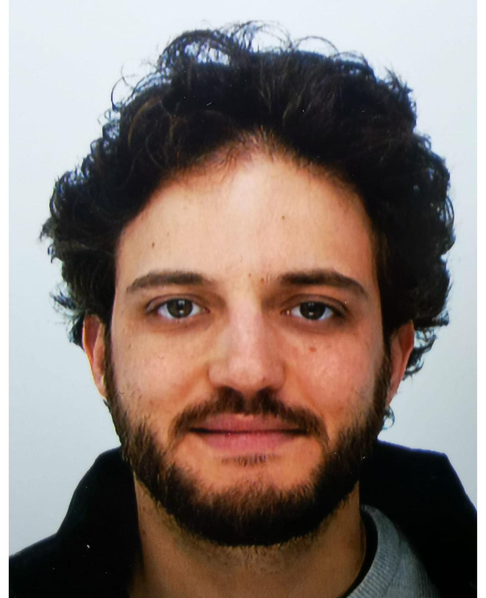
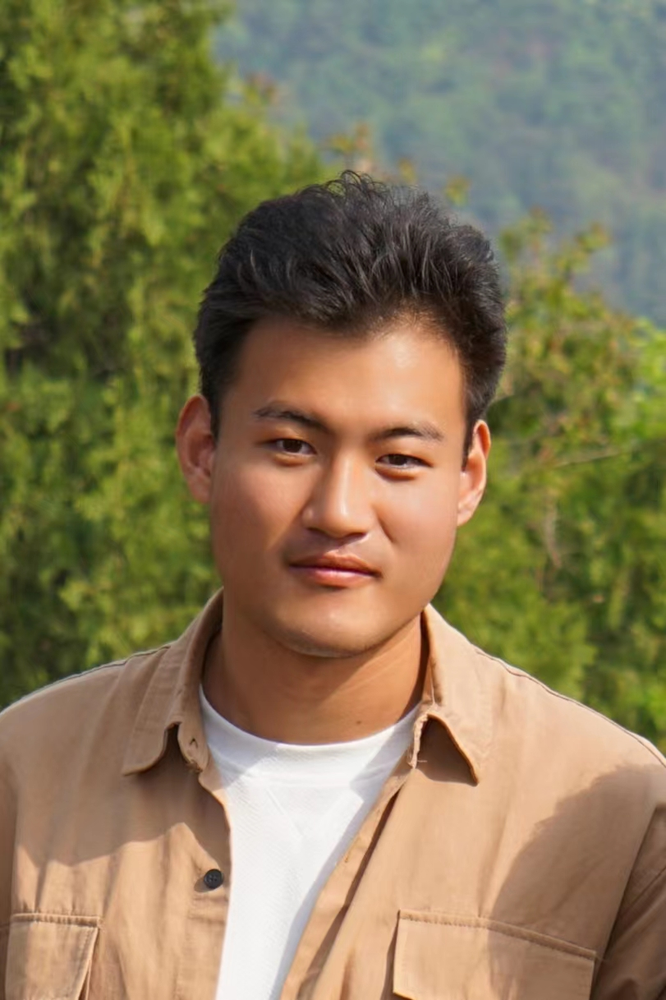
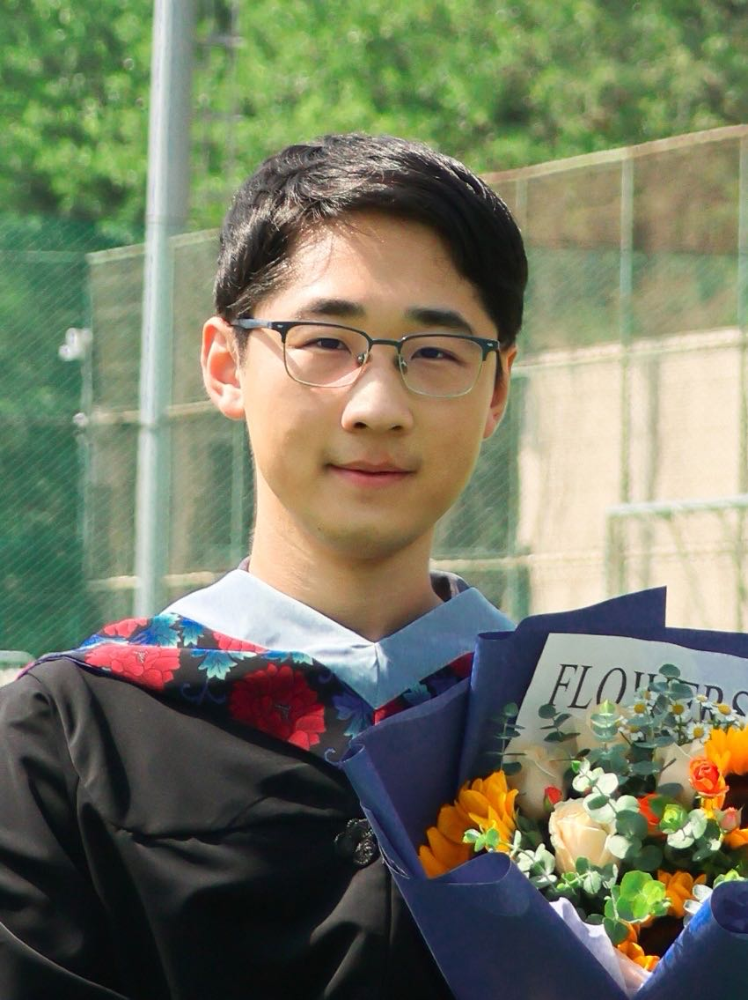
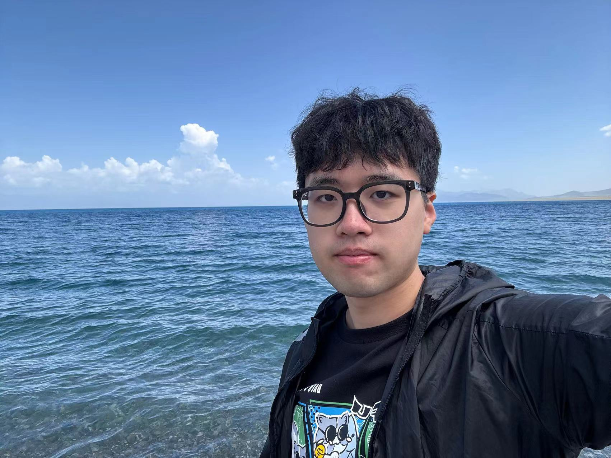
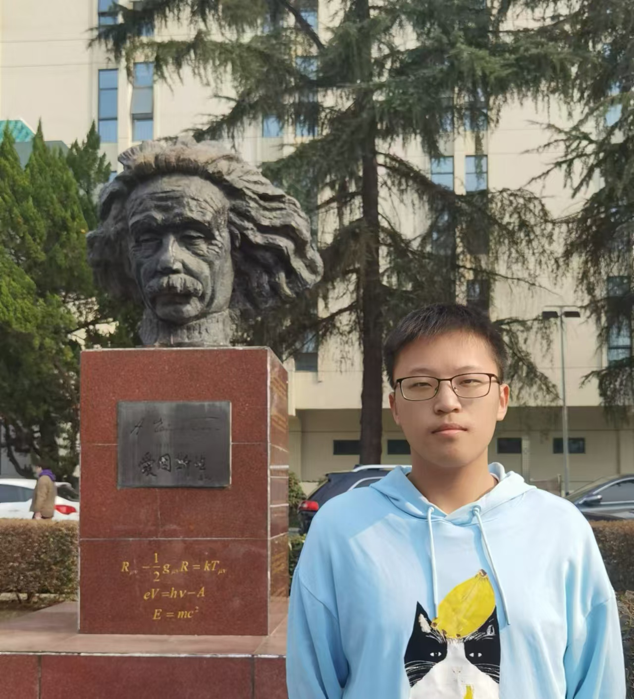
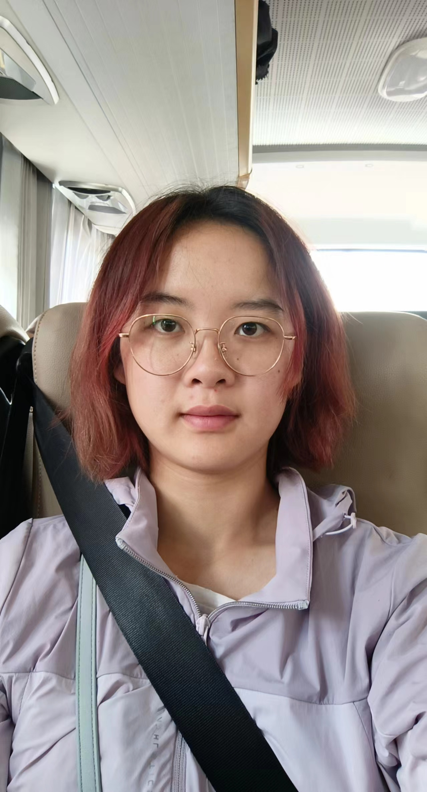

# 研究团队

[English Version](https://stonepi.github.io/group/) 本组每年有一个研究生名额，欢迎申请。我们会优先考虑参加中国科学院理论物理研究所夏令营的优秀本科生。

## 团队合影

2025年4月21日在昆明参加中国物理学会引力与相对论天体物理分会学术年会时合影。左起：洪文聪、侯业辉、张震宇、TBD、郭敏勇、陈斌、皮石、蔡坤雨、李子涵、俞千野、熊安贤屹。刘伟拍摄。

---

 2024年11月4日北京大学高能物理研究中心组会时合影，曹伟光拍摄。   后排左起：Diego Cruces、李子涵、张震宇、Cristian Joana、洪文聪。   前排左起：皮石、王奥、蔡坤雨。

---

 2024年7月20日理论物理研究所南楼三层咖啡厅组会时合影，吴洁强拍摄。 后排左起：呼阳阳、李子涵、王奥、洪文聪、张震宇。 中间排左起：佐々木節、蔡一夫、李佳乐、Diego Cruces。 前排左起：皮石、章颖理。

---

 2023年10月8日在理论物理研究所6620会议室组会时合影。韩耀耀拍摄。   左起：李子涵、洪文聪、蔡一夫、皮石、王嘉宁、Cristian Joana。

---

 2022年10月13日在理论物理研究所南楼6306办公室组会时合影。方晓拍摄。   左起：皮石、王嘉宁、洪文聪、李子涵。

---

 2021年7月28日在贵州平塘500米口径球面射电望远镜台址合影。 左起：皮石、王嘉宁。

---

 2020年11月23日在理论物理研究所南楼门前入职一月纪念留影。刘伟拍摄。

---

 2019年1月18日在理论物理研究所南楼6620会议室参加第三届理论物理及其交叉学科青年科学家论坛并荣获优秀报告奖时合影。 左起：周宇峰、舒菁、周森、易俗、马寅哲、周善贵、TBD、孟凡龙、王延珽、杨润秋、皮石、周海军、蔡荣根。

---

## 博士后

- **Cristian Joana** 2023年2月至——  
  
   
  Cristian Joana于2022年在比利时鲁汶天主教大学取得博士学位。他的博士生导师是[Sebastien Clesse](https://sebclesse.wixsite.com/clesse)和[Christophe Ringeval](http://cp3.irmp.ucl.ac.be/~ringeval/)。他主要关注早期宇宙的非线性演化的相关问题，特别是暴胀、重加热、奇异致密天体例如振荡子和原初黑洞等的早期形成和演化。他目前致力于数值计算方法的开发和使用，包括格点计算和数值相对论模拟。他是基于AMR的开源数值相对论模拟代码[GRChombo](https://www.grchombo.org/)的开发小组成员。 Cristian的论文发表情况可以在[INSPIRE](https://inspirehep.net/authors/2007073?ui-citation-summary=true)页面找到。 Cristian部分受到国家自然科学基金委理论物理专款博士后项目资助，项目号：12347132，项目名称：原初黑洞及其引力波信号（2024）；以及国家自然科学基金委外国学者基金资助，项目号：W2433007，项目名称：早期宇宙中的引力波和原初黑洞（2025）。

- **Diego Cruces** 2024年2月至——  
  
   
  Diego Cruces在巴塞罗那大学宇宙科学研究所（ICC-UB）获得博士学位，导师是[Cristiano Germani](https://icc.ub.edu/people/379)。他主要的研究兴趣集中于宇宙暴胀时期。他使用不同的数学框架来描述在暴胀时期产生的不均匀性，如宇宙学微扰论、$\delta $N形式、随机方法。特别是，他关注如何描述大的不均匀性（这不能用宇宙学微扰论描述），以及其唯象学后果，比如原初黑洞的形成。这些原初黑洞可以在这些大的涨落在暴胀之后重新进入视界时产生出来。 Diego的论文发表情况可以在[INSPIRE](https://inspirehep.net/authors/1893636?ui-citation-summary=true)页面找到。 Diego部分受到国家自然科学基金委理论物理专款博士后项目资助，项目号：12447160，项目名称：极早期宇宙中的显著不均匀性（2025）。

## 研究生

- **王嘉宁** 2019年9月入学 -  
  
   王嘉宁是2021级博士研究生。她的主要研究方向是暴胀时期的扰动理论以及原初黑洞形成。 2024年1月至3月，王嘉宁在日本加速器研究所（KEK）访问学习。合作导师为Volodymyr Takhistov。 2024年7月21日至9月中旬，王嘉宁在韩国基础科学研究院（IBS）访问学习。合作导师为Masahide Yamaguchi。 2024年10月20日至2024年12月14日，王嘉宁在日本东京大学卡弗理数物连携宇宙研究机构(Kavli IPMU)访问学习。合作导师为Misao Sasaki。 2025年9月起王嘉宁将前往日本东京大学卡弗理数物连携宇宙研究机构(Kavli IPMU)进行博士后研究。 她的论文发表情况见[INSPIRE](https://inspirehep.net/authors/2730443)。

- **洪文聪** 2021年9月入学 -   
  
   
  洪文聪是2023级博士研究生。他的主要研究方向是致密星合并及其相关的引力波天文。

- **王奥** 2022年9月入学 -   
  
   王奥是2024级博士研究生。他的主要研究方向是随机引力波背景、宇宙学微扰论等。 2025年2月至2025年11月，王奥在德国莱布尼兹大学汉诺威理论物理研究所(ITP, Leibniz University Hannover)访问学习。合作导师为Guillem Domenech。 他的论文发表情况见[INSPIRE](https://inspirehep.net/authors/2718599)页面。

- **李子涵** 2023年9月入学 -    李子涵是2023级硕士研究生。他的主要研究方向是暴胀模型构建、随机暴胀等。

- **熊安贤屹** 2024年9月入学 -    熊安贤屹是2024级硕士研究生。他的主要研究方向是修改引力。

- **俞千野** 2025年9月入学 -    俞千野现为武汉大学物理学院本科生，指导老师为范锡龙教授。他将于2025年9月进入中国科学院大学研究生院攻读研究生并加入本课题组。

- **蔡坤雨** 2025年9月入学 -    蔡坤雨现为北京大学天文系本科生，指导老师为江林华教授。她将于2025年9月进入北京大学理论物理研究所攻读研究生并加入本课题组，由我和陈斌老师共同指导。

## 访问学生

- **廖涌贤** 2021年暑期 廖涌贤是多伦多大学的2018级本科生。他于2022年9月进入多伦多大学攻读研究生。

- **李潘胤延** 2023年秋至2024年春 李潘胤延是北京邮电大学计算机学院的2021级本科生。她将于2025年9月进入四川大学理论物理中心杨海棠老师课题组继续研究生课程。

- **呼阳阳** 2024年暑假 呼阳阳是山东大学物理学院2022级本科生。

- **谢永萌** 2025年暑假 谢永萌是北京师范大学物理与天文学院2023级本科生。

- **张震宇** 长期 张震宇是北京大学物理学院的博士研究生，导师为陈斌教授。他的主要研究兴趣是黑洞物理和黑洞阴影。 他的论文发表情况见[INSPIRE](https://inspirehep.net/authors/1744398)页面。

---

更新日期：2025年5月17日
