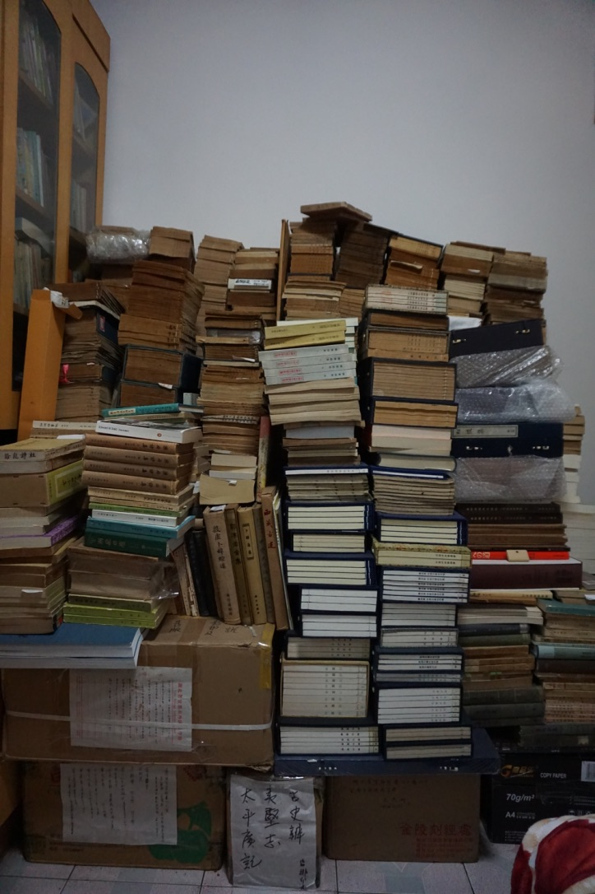
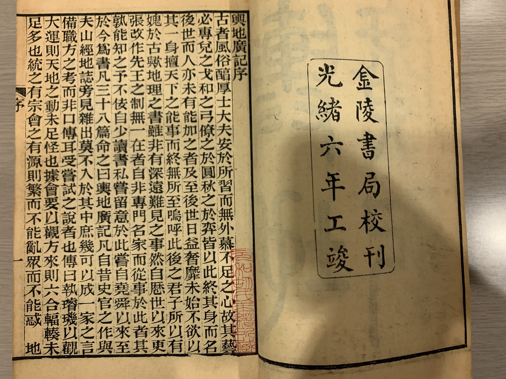
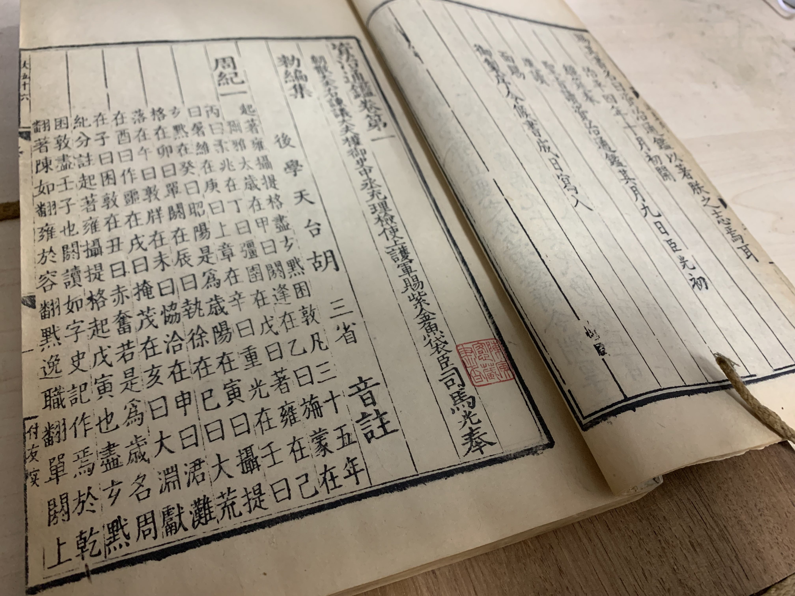

# 兴趣爱好

Updated Oct 2, 2023. [English Version]()

---

## 阅读

2002年10月17日在日本东京神保町[山本书店](https://www.kosho.or.jp/abouts/?id=12010830)店内读书

---

## 古书收藏

2020年1月26日旧居内部分收藏
《舆地广记》，光绪六年(1880)金陵书局版。胡玉缙旧藏。2022年12月17日得之于日本东京神保町山本书店。《资治通鉴二百九十八卷附释文辩误十二卷》，同治八年(1869)江苏书局修补鄱阳胡氏仿元刊本，陈寅恪旧藏。

---

## 足球

2011年8月6日在国家体育场鸟巢观看米兰德比
2014年4月30日在浦项工大五人制足球场
“\*\*\*！退钱！”2016年10月6日在西安朱雀体育场

---

## 电子游戏

2022年11月20日在日本东京[スーパーポテト](https://www.superpotato.com/shop/akihabara/)怀旧街机厅玩[三国志2](https://en.wikipedia.org/wiki/Warriors_of_Fate)

---
