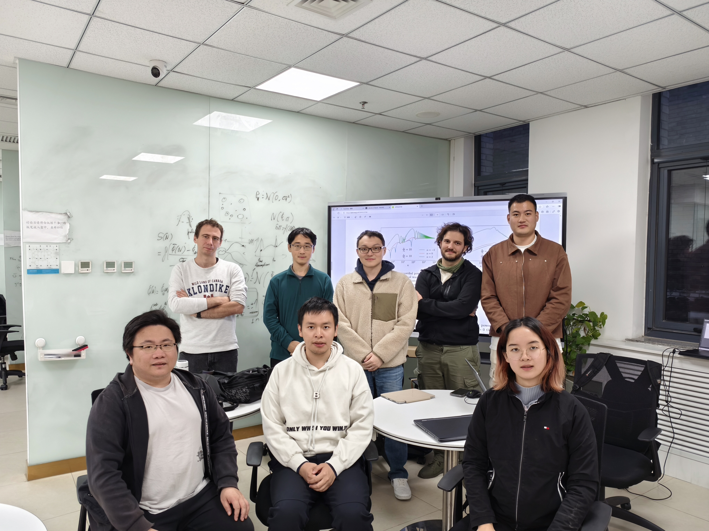

# Group Members

[中文版本 (Chinese Version)](https://stonepi.github.io/file/group-zh/)

Welcome to apply for Doctoral Programs for International Students of Chinese Academy of Sciences. The announcement will be released in November every year, and the deadline will be February 15th next year. As an example, please check [the announcement in 2025](http://english.itp.cas.cn/join/phdprog/202411/t20241118_694415.html). 

## Group Photo

Group photo with Prof. Bin Chen in the Annual Meeting of the Chinese Physics Society Gravity and Relativistic Astrophysics Division 2025 in Kuming. Photoed by Mr. Wei Liu. From left: Wencong Hong, Yehui Hou, Zhenyu Zhang, Zhi-xing Zhao, Minyong Guo, Bin Chen, Shi Pi, Kunyu Cai, Zihan Li, Qianye Yu, Anxianyi Xiong.

---

 Group Meeting on November 4th, 2024. Photographed by Wei-Guang Cao.  Back row: Diego Cruces, Zi-han Li, Zhenyu Zhang, Cristian Joana, Wencong Hong. Front row: Shi Pi, Ao Wang, Kunyu Cai.

---

 Group Meeting on July 23rd, 2024. Photoed by Jie-qiang Wu. Back row: Yangyang Hu, Zi-han Li, Ao Wang, Wencong Hong, Zhenyu Zhang. Middle row: Misao Sasaki, Yi-fu Cai, Jiale Kaye Li, Diego Cruces.  Front row: Shi Pi, Ying-li Zhang.

---

 Group meeting in Seminar Room 6620 of ITP South Building, Oct 8th, 2023. Photoed by Yaoyao Han.  From left: Zihan Li, Wencong Hong, Yifu Cai, Shi Pi, Jianing Wang, Cristian Joana.

---

 Group meeting in my office (Room 6306 ITP South Bldg.), Oct 13th, 2022. Photoed by Xiao Fang.  From left: Shi Pi, Jianing Wang, Wencong Hong, Zihan Li.

---

 Teaching at UFITS Summer School at the site of Five-hundred-meter Aperture Spherical Radio Telescope (FAST), July 28th, 2021.  From left: Shi Pi, Jianing Wang.

---

 One-month after working in ITP-CAS as a faculty member, Nov. 23rd, 2020. Photo taken by Wei Liu.

---

 Group photo for the best presentation winners of the 3rd Youth Forum of Theoretical Physics and Interdisciplinary Fields, held on Jan 18th, 2019.  From left: Yufeng Zhou, Jing Shu, Sen Zhou, Su Yi, Yin-Zhe Ma, Shangui Zhou, TBD, Fan-Long Meng, Yanting Wang, Run-Qiu Yang, Shi Pi, Haijun Zhou, Rong-Gen Cai.

---

## Postdocs

- **Diego Cruces** Feb 2024 -    Diego Cruces got his PhD in the Institute of Cosmos Sciences of the University of Barcelona (ICC-UB) under the supervision of [Cristiano Germani](https://icc.ub.edu/people/379). His main research interest is related with the period of cosmological inflation, he has been working in different mathematical frameworks which aim to describe the inhomogeneities generated during inflation such as cosmological perturbation theory, the $\delta$N formalism or the stochastic approach. Particularly, he is interested in the description of large inhomogeneities (which cannot be described with cosmological perturbation theory) and its phenomenological consequences, such as the formation of primordial black holes, which can be generated once these large fluctuations reenter the horizon after inflation.  Diego's publication can be found here on [INSPIRE](https://inspirehep.net/authors/1893636?ui-citation-summary=true). Diego is partly funded by the NSFC Special Grant for Theoretical Physics No. 12447160 (2025) (*Towards a non-perturbative description of cosmological inflation.*).

## Students

- **Wencong Hong** Sept 2021 -   Wencong Hong is a PhD student. He works on the stochastic gravitational waves from the compact objects.

- **Ao Wang** Sep 2022 -   Ao Wang is a PhD student. He works on the stochastic gravitational waves and primordial black hole formation. From February 2025 to November 2025, Ao visits Prof. Guillem Domenech in ITP, Leibniz University Hannover. From December 2025 to November 2026, Ao will visit Prof. Takahiro Tanaka in Kyoto University. Ao's publication can be found here on [INSPIRE](https://inspirehep.net/authors/2718599).

- **Zihan Li** Sept 2023 -   Zihan Li is a master student.

- **Anxianyi Xiong** Sept 2024 -   Anxianyi is a master student.

- **Qianye Yu** Sept 2025 -   Qianye is a a master student.

- **Kunyu Cai** Sept 2025 -   Kunyu is a graduate student in Physics Department, Peking University. She is co-supervised by Prof. Bin Chen and me.

- **Xia Tang** Sept 2026 -   Xia Tang is an undergraduate student in Department of Physics, Zhejiang University. In Oct 20, 2025, he won the Zhejiang University Chu Kochen Scholarship. Xia will become a graduate student of ITP, CAS and join our group from September 2026.

## Alumni

- **Jianing Wang** Sep 2019 - July 2025  [Jianing Wang](https://inspirehep.net/authors/2730443) is now a postdoc in Kavli IPMU, the University of Tokyo. Her host researchers will be Misao Sasaki and Elisa Ferreira.  She visited KEK in Japan from February 2024 to April 2024. She visited the Institute of Basic Sciences in Korea, from July 15th to the mid of September, 2024. Her host researcher is Prof. Masahide Yamaguchi. She visited Kavli IPMU, the University of Tokyo, Japan, from October 20th to December 14th, 2024. Her host researchers are Prof. Misao Sasaki. and Prof. Elisa Ferreira.

- **Cristian Joana**  Feb 2023 - Sept 2025   
  Cristian Joana got his PhD in the Université catholique de Louvain in 2022. His PhD supervisors are [Sebastien Clesse](https://sebclesse.wixsite.com/clesse) and [Christophe Ringeval](http://cp3.irmp.ucl.ac.be/~ringeval/). He mainly focuses on cosmology of the early universe, particularly on cosmic inflation and the reheating, and in the early formation of exotic compact objects such as oscillons and primordial black holes.  He is currently involved in the development and usage of numerical methods, including lattice and numerical relativity simulations. He is one of the developers of [GRChombo](https://www.grchombo.org/), an AMR based open-source code for numerical relativity simulations. Cristian's publication can be found here on [INSPIRE](https://inspirehep.net/authors/2007073?ui-citation-summary=true).  Cristian is partly funded by the NSFC Special Grant for Theoretical Physics No. 12347132 (2024) (*Primordial Black Hole and its Gravitational Wave Signal*), and by the NSFC Research Fund for International Scientists No. W2433007 (*Early Universe Gravitational Waves and Primordial Black Holes*).

- 

## Visitors

- **Yong-Xian Liao** Summer 2021 
  
  Yong-Xian was an undergraduate student in the University of Toronto (2018 -- 2022).

- **Panyingyan Li** Autumn 2023 -- Spring 2024 Panyingyan is an undergraduate student in School of Computer Science, Beijing University of Posts and Telecommunications (2021 -- 2025). She will join Prof. Haitang Yang's group in Sichuan University since September 2025.

- **Yangyang Hu** Summer 2024 Yangyang is an undergraduate student in School of Physics, Shandong University (2022 --).

- **Zhenyu Zhang** Long-term  Zhenyu is a PhD candidate from Peking University (Supervisor: Bin Chen). He mainly works on black hole shadow. His publication can be found on [INSPIRE](https://inspirehep.net/authors/1744398).

---

Updated Aug 5th, 2025.
