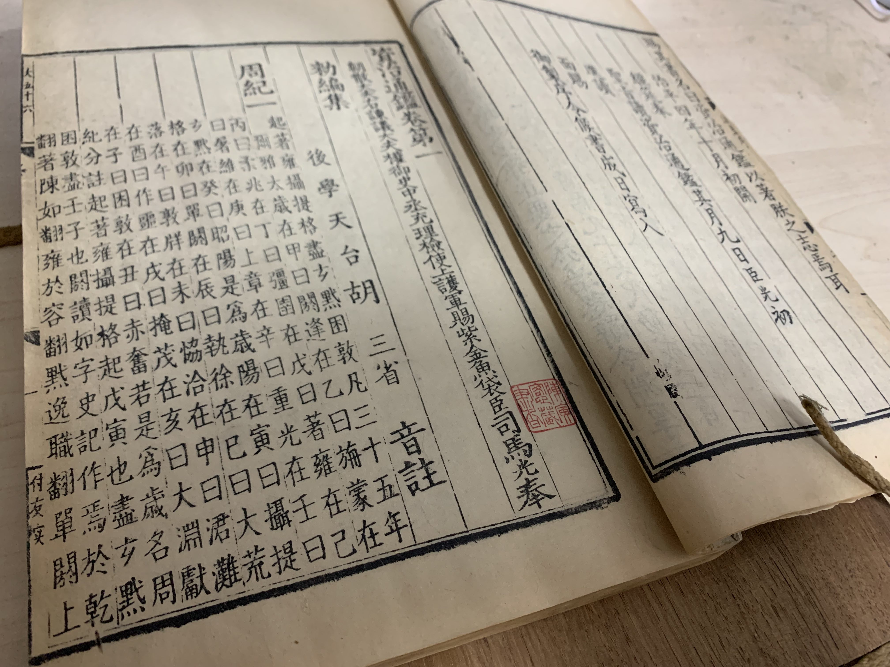

# Hobbies

---

## Collecting Ancient Books 藏书

About the category of my collections, click [here](/books).

我正在撰写自己的藏书目录，请点击[此处](/books/)查看草稿。

Jan 26, 2020. Part of my collection. 
《舆地广记》，光绪六年(1880)金陵书局版。胡玉缙旧藏。2022年12月17日得之于日本东京神保町山本书店。

《资治通鉴二百九十八卷附释文辩误十二卷》，同治八年(1869)江苏书局补刊鄱阳胡氏仿元刊本，陈寅恪旧藏。

---

## Reading 阅读

Dec 17, 2022. Reading in [Yamamoto Bookstore](https://www.kosho.or.jp/abouts/?id=12010830), Tokyo, Japan.

---

## Football 足球

Aug 6, 2011. Derby della Madonnina in the National Stadium, Beijing.
 April 30, 2014, in Postech Futsal Ground, Korea.
"Motherf***er! Refund!'' Oct 6, 2016, in Zhuque Stadium, Xi'an China.

---

## Billiards 台球

---

## Playing Video Games 电子游戏

Nov 20, 2022, playing "[Warriors of Fate (Tenchi wo Kurau 2)](https://en.wikipedia.org/wiki/Warriors_of_Fate)" in [Super Potato (Akihabara)](https://www.superpotato.com/shop/akihabara/) Retro Game Center, Japan.

---
